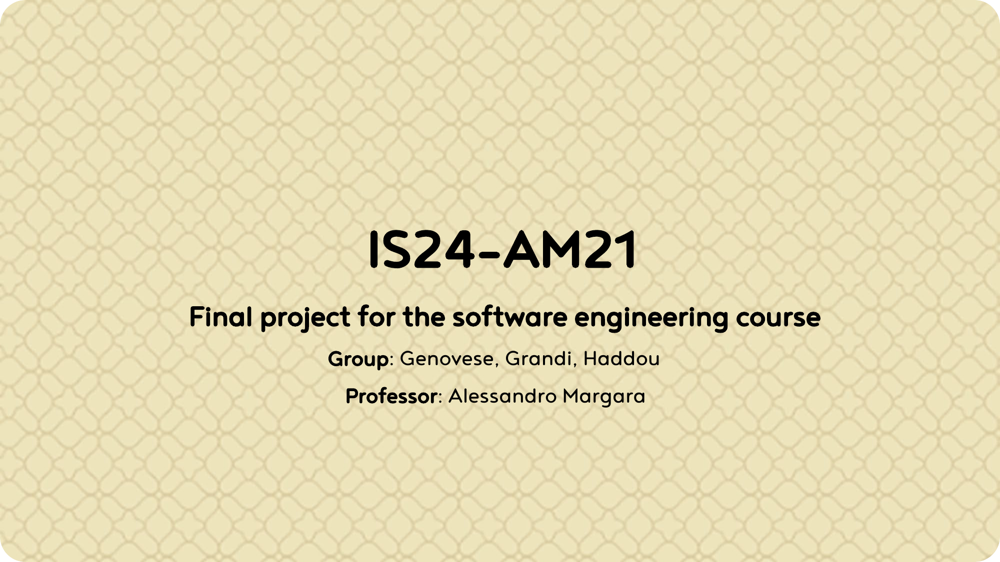
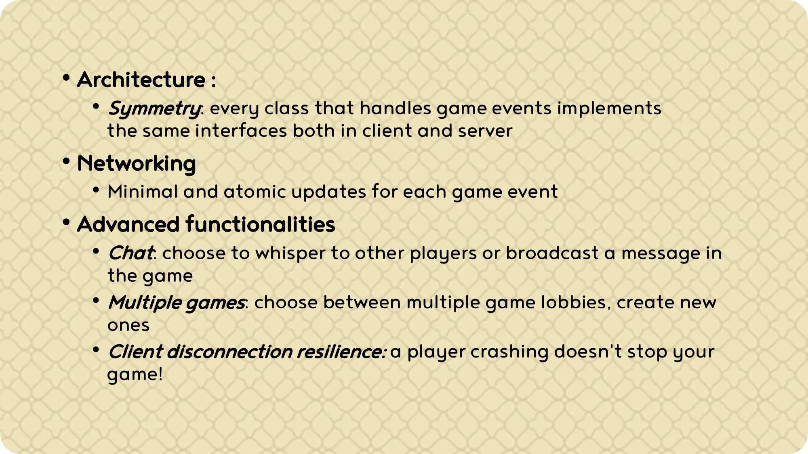
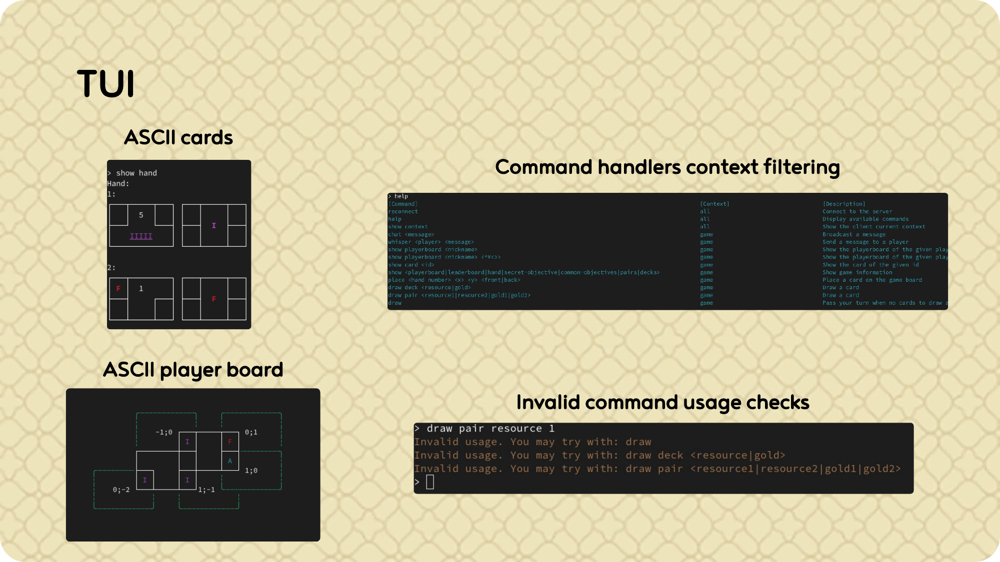
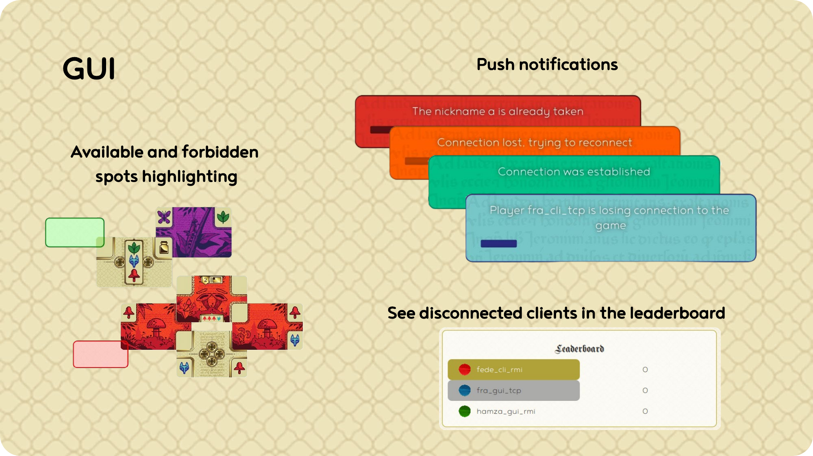
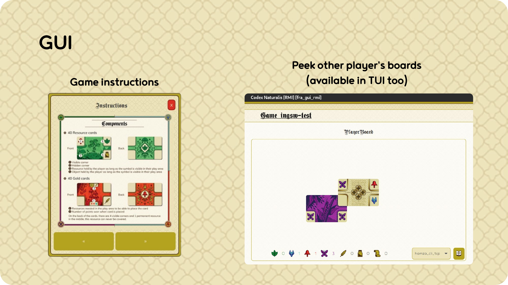

# IS24-AM21
Prova Finale (progetto di ingegneria del software) A.A. 2023-2024

## Overview
 This project aims to present a Java version of the game Codex Naturalis ©. 


 
## Features and development
 <div style="display: flex; gap: 10px; scroll-snap-type: x mandatory; overflow-x: auto; scroll-padding: 50px 0 0 0;">
        
        
        
        
        
          
</div>


## Authors
- 10765842 [Genovese](francesco1.genovese@mail.polimi.it) ([@frephs](https://github.com/frephs))
- 10802488 [Grandi](federico1.grandi@mail.polimi.it) ([@endbug](https://github.com/endbug))
- 10834404 [Haddou](hamza.haddou@mail.polimi.it) ([@litlatte](https://github.com/litlatte))


## Development status:

| Requirement                     | Scope                    | Status |
|---------------------------------|--------------------------|:------:|
| Complete Rules                  | Model                    |   🟢   |
| TUI                             | View                     |   🟢   |
| GUI                             | View                     |   🟢   |
| Rmi                             | Connection               |   🟢   |
| Socket                          | Connection               |   🟢   | 
| Chat                            | Advanced functionality 1 |   🟢   |
| Multiple games                  | Advanced functionality 2 |   🟢   |
| Client disconnection resilience | Advanced functionality 3 |   🟡   |
| Game saving on disk             | Advanced functionality 4 |   ❌    |

>[!TIP]
> See the [deliverables folder](deliveries) for documentation and final release.

## Building the source

To build a JAR file for your OS, run the following command:

```
cd codex && mvn clean package
```

> [!NOTE]
> `mvn package` automatically runs tests as well, which should take about 50-60 seconds.  
>  To speed things up, you can run the following command instead:
> ```
> mvn package -D maven.test.skip
> ```

## Usage
Run the game with
```
$ java -jar /path/to/AM21-CodexNaturalis.jar
```
### Server
First, run the server using the `--server` flag. Specify the ports with the `--tcp-port` and `--rmi-port` flags.

If not specified, the defaults ports for the server are `2002` for TCP and `2024` for RMI.

### Client 
Then, run the client. Specify the server IP with the `--ip` flag. If not specified, the default is `localhost`. 

Specify the port with the `--port` flag. If not specified, the default is `2002` for TCP and `2024` for RMI.

Specify the connection type with the `--rmi` or `--tcp` flag. If not specified, the default is TCP.

Specify the interface with the `--cli` or `--gui` flag. If not specified, the default is GUI.


### Help message
```
$ java -jar AM21-CodexNaturalis.jar --help

_________            .___              
\_   ___ \  ____   __| _/____ ___  ___ 
/    \  \/ /  _ \ / __ |/ __ \\  \/  / 
\     \___(  <_> ) /_/ \  ___/ >    <  
 \______  /\____/\____ |\___  >__/\_ \ 
        \/            \/    \/      \/ 
Usage: 
Server mode: 
   java -jar codex.jar --server
Client mode: 
   java -jar codex.jar
Client Parameters: 
   --rmi: use RMI connection (by default it uses TCP)
   --port=<port>: specify the port to connect to (default: 2002 for TCP, 2024 for RMI)
   --ip: the IP address to connect to
   --cli: use TUI client (by default it uses GUI)
Server Parameters: 
   --server: [REQUIRED] start as server (by default it starts as client)
   --rmi-port=<port>: specify the RMI Server port (default 2024)
   --tcp-port=<port>: specify the TCP Server port (default 2002)
Common Parameters: 
   --help: print this help message
```


## License
All rights to Codex Naturalis © are owned by Cranio Creations ®, which provided the graphical resources to be used for educational purposes only.
