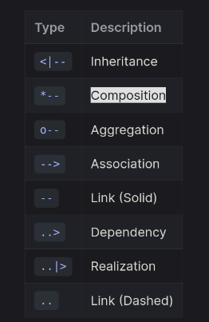
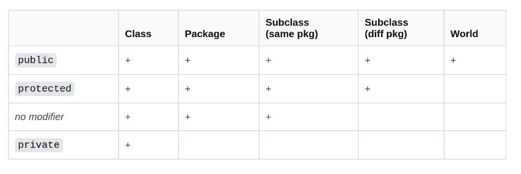
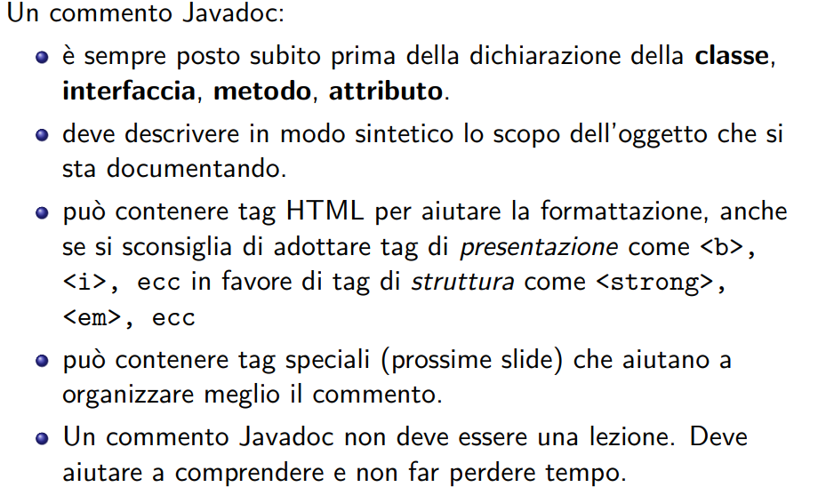

## Todo 
- [ ] Aggiungere i constructor a tutte le classi e verificare che ci siano tutti i metodi per le cose che intendiamo fare con le classi
- [ ] Controllare la direzione delle frecce e sistemare le labels accordingly
- [ ] Rivedere la visibilità di metodi e attributi

## Notazioni

