# Message structure class diagram
## Table of Contents

- [Message structure class diagram](#message-structure-class-diagram)
  - [Client requests](#client-requests)
  - [Server responses](#server-responses)
  - [Client actions](#client-actions)
  - [View updates](#view-updates)
  - [Server errors](#server-errors)

## Class diagram

## Client requests 

## Server responses 

## Client actions 

## View updates 

```mermaid
classDiagram
    class ViewUpdatingMessage{
        <<Abstract>>
        +playerId: int
    }

     namespace Lobby {
        class PlayerNicknameSetMessage {
            + nickname: String
        }

        class TokenColorSetMessage {
            + color: TokenColorType
        }

        class PlayerGameJoinMessage{
            + lobbyId: int
        }
    }
    ViewUpdatingMessage <|-- PlayerNicknameSetMessage  : realization
    ViewUpdatingMessage <|-- TokenColorSetMessage  : realization
    ViewUpdatingMessage <|-- PlayerGameJoinMessage  : realization


    namespace Game{
        class CardPlacedMessage{
            + x: int
            + y: int
            + side: cardSideType
            + cardId: int
        }

        class DeckCardDrawnMessage{
            + deck: DrawingDeckType
        }

        class CardPairDrawnMessage{
            + first: Boolean
            + deck: DrawingDeckType
            + newCardId: int
        }

        class RemainingTurnsMessage {
            + turns: int
        }

        class GameOverMessage {
        
        }

        class PlayerScoreUpdateMessage {
            + delta: int
        }

        class WinningPlayerMessage {
            winnerNickname: String
        }

        class DeckCardDrawnMessage{
            + cardId: int
        }
        class CardPairDrawnMessage{
            + cardId: int
        }

    }
    
    ViewUpdatingMessage <|-- CardPlacedMessage  : realization
    ViewUpdatingMessage <|-- DeckCardDrawnMessage  : realization
    ViewUpdatingMessage <|-- CardPairDrawnMessage  : realization
    ViewUpdatingMessage <|-- RemainingTurnsMessage  : realization
    ViewUpdatingMessage <|-- GameOverMessage  : realization
    ViewUpdatingMessage <|-- PlayerScoreUpdateMessage  : realization
    ViewUpdatingMessage <|-- WinningPlayerMessage  : realization
    ViewUpdatingMessage <|-- DeckCardDrawnMessage  : realization
    ViewUpdatingMessage <|-- CardPairDrawnMessage  : realization
    
```

## Server errors
