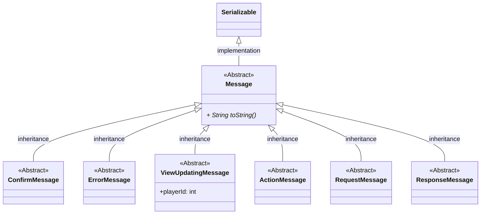
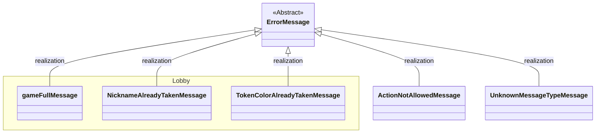
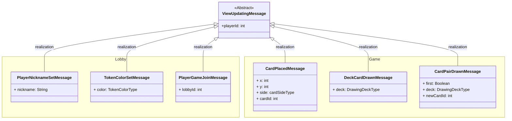
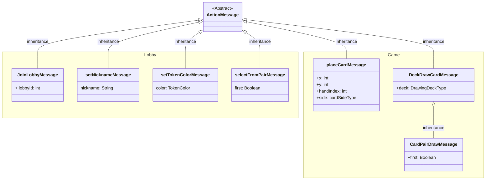
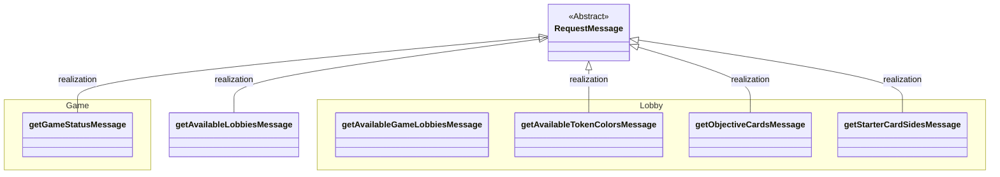
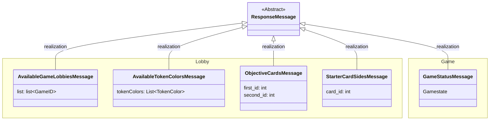

```mermaid
classDiagram
 Serializable <|-- Message : implementation

    %% SERVER MESSAFES    


    class Message {
        <<Abstract>>    
        + String toString()*
    }


    class ConfirmMessage {
        <<Abstract>> 
    }
    Message <|-- ConfirmMessage : inheritance
    

    class ErrorMessage {
        <<Abstract>> 
    }

    Message <|-- ErrorMessage : inheritance
    

    class ViewUpdatingMessage{
        <<Abstract>>
        +playerId: int
    }

    Message <|-- ViewUpdatingMessage : inheritance

    

    class ActionMessage {
        <<Abstract>> 
    }

    class RequestMessage {
        <<Abstract>> 
    }

    class ResponseMessage {
        <<Abstract>> 
    }
    

    

    %% CLIENT MESSAGES

    Message <|-- ActionMessage : inheritance
    Message <|-- RequestMessage : inheritance
    Message <|-- ResponseMessage : inheritance
    

```

## Error messages

```mermaid
classDiagram

    class ErrorMessage {
        <<Abstract>>    
    }

    ErrorMessage <|-- ActionNotAllowedMessage : realization
    ErrorMessage <|-- UnknownMessageTypeMessage : realization

    class ActionNotAllowedMessage {

    }
    namespace Lobby {
        class gameFullMessage {

        }

        class NicknameAlreadyTakenMessage {
            
        }

        class TokenColorAlreadyTakenMessage {
            
        }
    }

    ErrorMessage <|-- gameFullMessage : realization
    ErrorMessage <|-- NicknameAlreadyTakenMessage : realization
    ErrorMessage <|-- TokenColorAlreadyTakenMessage : realization

    class UnknownMessageTypeMessage {
        
    }


```
## View updating messages

```mermaid
classDiagram
    class ViewUpdatingMessage{
        <<Abstract>>
        +playerId: int
    }

     namespace Lobby {
        class PlayerNicknameSetMessage {
            + nickname: String
        }

        class TokenColorSetMessage {
            + color: TokenColorType
        }

        class PlayerGameJoinMessage{
            + lobbyId: int
        }
    }
    ViewUpdatingMessage <|-- PlayerNicknameSetMessage  : realization
    ViewUpdatingMessage <|-- TokenColorSetMessage  : realization
    ViewUpdatingMessage <|-- PlayerGameJoinMessage  : realization


    namespace Game{
        class CardPlacedMessage{
            + x: int
            + y: int
            + side: cardSideType
            + cardId: int
        }

        class DeckCardDrawnMessage{
            + deck: DrawingDeckType
        }

        class CardPairDrawnMessage{
            + first: Boolean
            + deck: DrawingDeckType
            + newCardId: int
        }
    }
    
    ViewUpdatingMessage <|-- CardPlacedMessage  : realization
    ViewUpdatingMessage <|-- DeckCardDrawnMessage  : realization
    ViewUpdatingMessage <|-- CardPairDrawnMessage  : realization
```

## Client action messages

```mermaid
classDiagram
    class ActionMessage {
        <<Abstract>> 
    }

    namespace Lobby{
        class JoinLobbyMessage {
        + lobbyId: int
        }

        class setNicknameMessage{
            nickname: String
        }

        class setTokenColorMessage {
            color: TokenColor
        }

        
        class selectFromPairMessage {
            first: Boolean
        }
    
    }

    ActionMessage <|-- JoinLobbyMessage : inheritance
    ActionMessage <|-- setNicknameMessage : inheritance
    ActionMessage <|-- setTokenColorMessage : inheritance
    ActionMessage <|-- selectFromPairMessage: inheritance

    namespace Game{
    
    class placeCardMessage{
        +x: int
        +y: int
        +handIndex: int 
        +side: cardSideType 
    }

    class DeckDrawCardMessage{
        +deck: DrawingDeckType
    }

    class CardPairDrawMessage {
        +first: Boolean

    }
    }
    
    ActionMessage <|-- placeCardMessage: inheritance
    ActionMessage <|-- DeckDrawCardMessage: inheritance

    DeckDrawCardMessage <|-- CardPairDrawMessage  : inheritance

```

## Request messages

```mermaid
classDiagram
    class RequestMessage {
        <<Abstract>> 
    }

    namespace Game{
        class getGameStatusMessage{

        }
    }
    
    namespace Lobby {

        class getAvailableGameLobbiesMessage {
            
        }
        class getAvailableTokenColorsMessage {
        
        }

        class getObjectiveCardsMessage {

        }

        class getStarterCardSidesMessage{

        }

    } 

    RequestMessage <|-- getAvailableLobbiesMessage : realization
        RequestMessage <|-- getAvailableTokenColorsMessage : realization
        RequestMessage <|-- getObjectiveCardsMessage : realization
        RequestMessage <|-- getStarterCardSidesMessage : realization

    
    %% game
    RequestMessage <|-- getGameStatusMessage : realization


```

## Response messages

```mermaid
classDiagram 
    class ResponseMessage {
        <<Abstract>> 
    }
    namespace Lobby {
        class AvailableGameLobbiesMessage{
            list: list~GameID~
        }

        class AvailableTokenColorsMessage{
            tokenColors: List~TokenColor~
        }

        class ObjectiveCardsMessage{
            first_id: int
            second_id: int
        }

        class StarterCardSidesMessage{
            card_id: int
        }
        
    
    }

    namespace Game{
        class GameStatusMessage{
            Gamestate
        }
    }

    ResponseMessage <|-- AvailableGameLobbiesMessage : realization
    ResponseMessage <|-- AvailableTokenColorsMessage : realization
    ResponseMessage <|-- ObjectiveCardsMessage : realization
    ResponseMessage <|-- StarterCardSidesMessage : realization
    ResponseMessage <|-- GameStatusMessage : realization
    
```