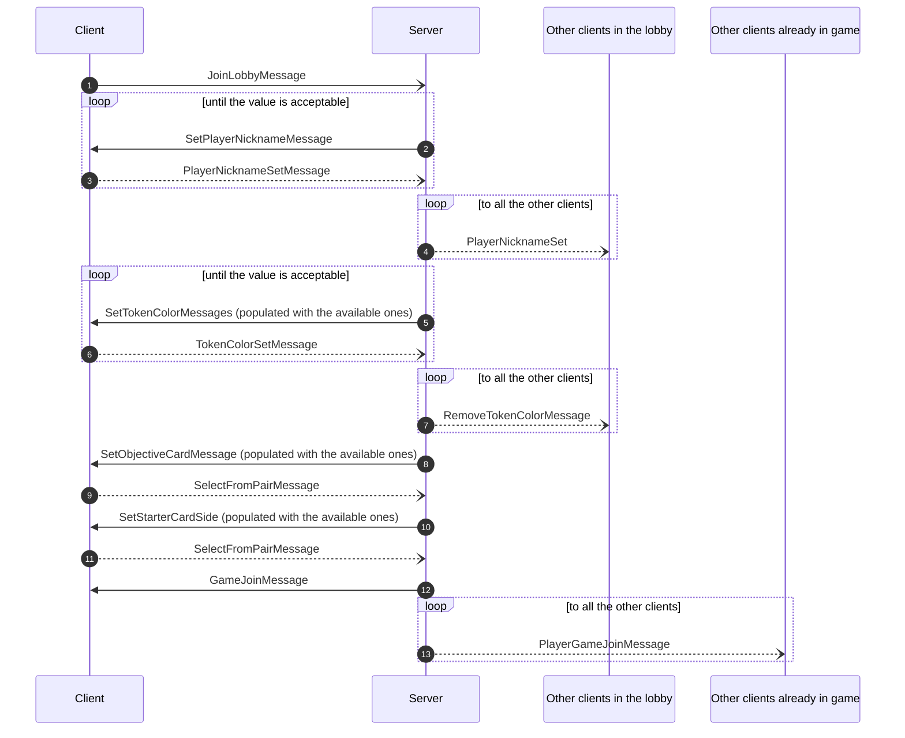
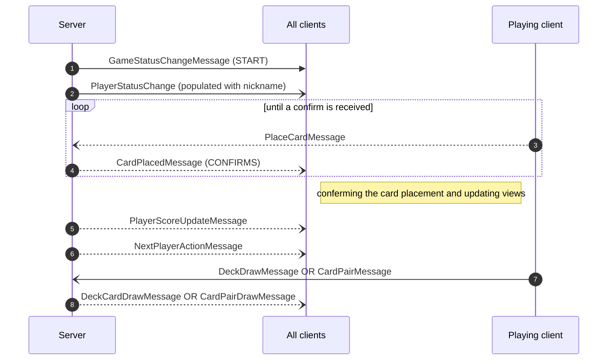
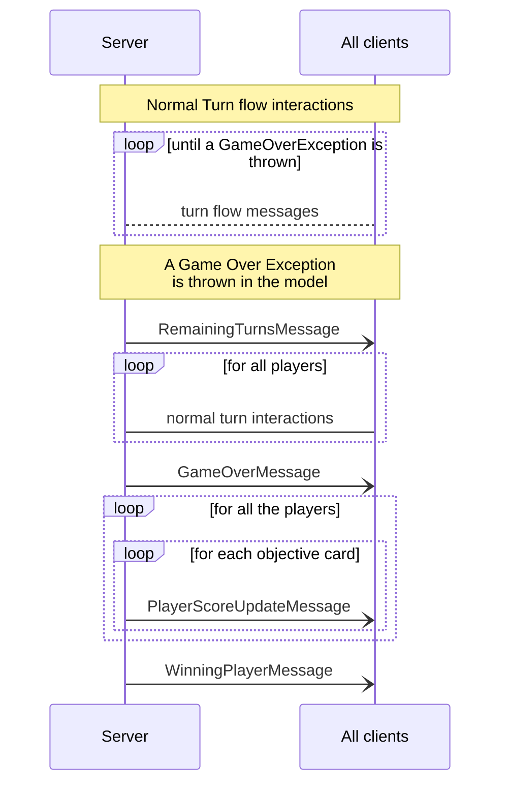
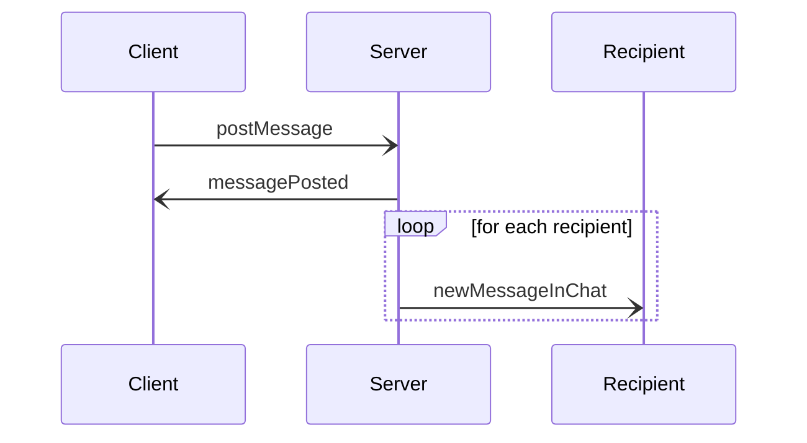

# Network Protocol
The network protocol we designed will implement both RMI and Socket functionality.
Both client and server are equipped with a message parser and RMI interfaces which are meant to update the views in the client side and call controller methods in the server side.

## Notes on RMI 
In this documentation, we're going to represent only the Socket messages since every message corresponds to a remote method invocation as there is duality in the approaches.

### General Flow for non-permitted requests

### Player Lobby Flow
the Player Building Process in the Game Lobby, being it divided into sequential essential steps,
a different message from the last one received is meant as a confirm message 

## Normal game turns flow 

## Game over flow

## Chat
This comunication happen when a player want to write a message in the chat. They send the postMessage to the Server that will notify the player that the message has been received and posted; later it will send a notification to all the other players that there is a new message in the chat.

