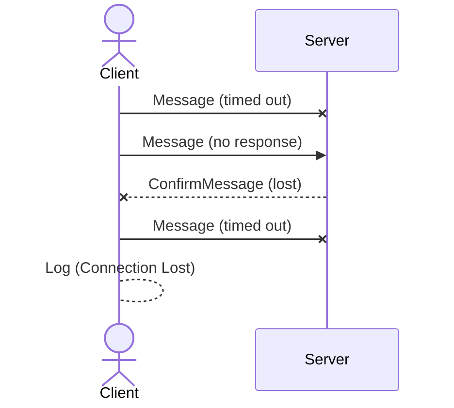
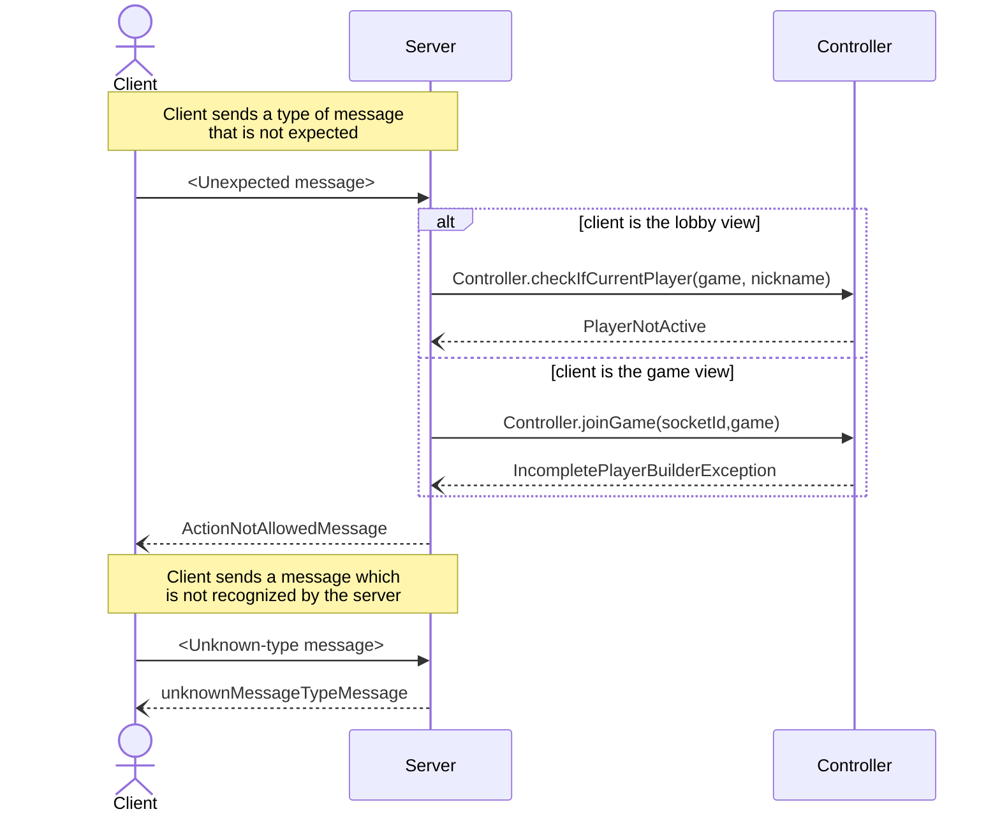
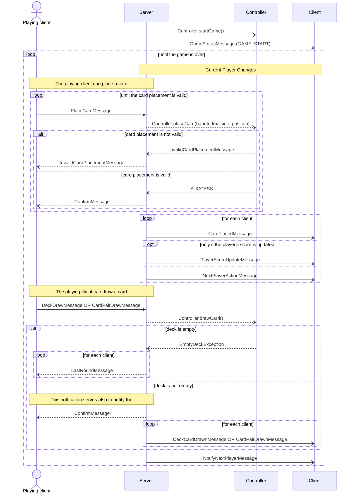
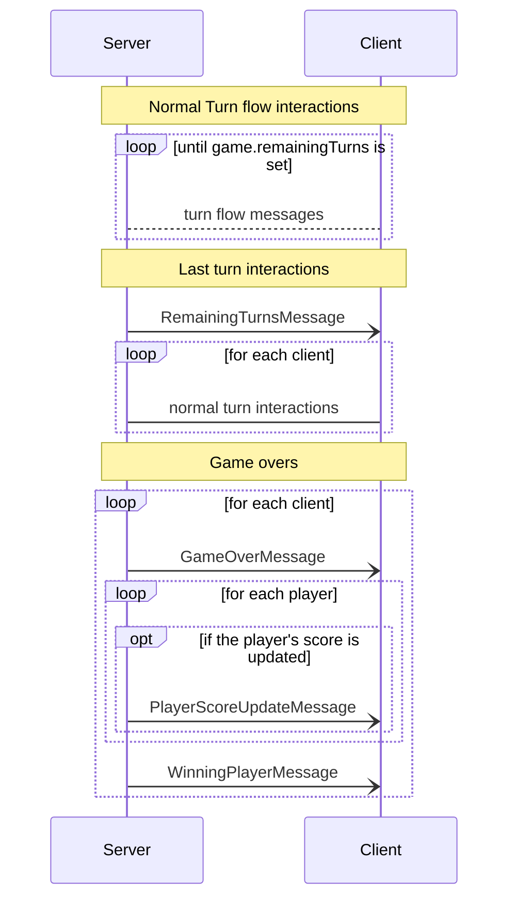
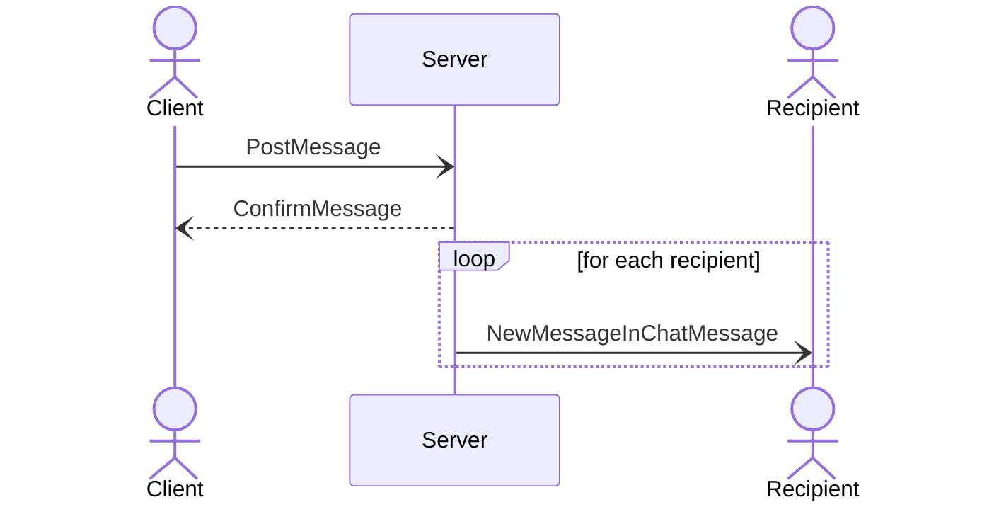

# Network Protocol
The network protocol we designed is meant to be implemented with both RMI and Client-Server Socket functionality.
Both client and server are equipped with a message parser for serialized Java objects sent through the network and a set of RMI interfaces which are meant to update the views in the client and call controller methods to update the model in the server.

## Notes on RMI 
In this documentation only Socket messages are represented, as there is duality in the two approaches since every message corresponds to a remote method invocation.

## General message handling 

### Failed connection handling
After a connection is enstablished, if the servers fails to respond to a message before the timeout, the clients will try to resend the message for a maximum of 3 times. If the server still fails to respond, the client will close the connection and notify the user that the connection has been lost.

### "Not allowed" message handling
In the event a client sends a message for an action that the server doesn't expect or that they cannot perform in that moment, and in the event a client might be modified or 'enhanced' in a way the server does not contemplate, we have messages in place to send to the aforesaid client. 

## Game Dynamics' Flows
### Lobby Flow
The player building process requires a series of essential steps, which are reported in the following sequence diagram.

Other than `ConfirmMessage`, which is required by the client to confirm the message has been received and handled correctly, we added a series of messages whose recipients are all the clients in the lobby or in the game. They are used to update the views of the clients and to notify them of the status of the lobby.

```mermaid
sequenceDiagram
    actor Client
    autonumber
    
    # Get the available lobbies
    Note over Client,Server : Client is in the lobby view
    Client ->> Server : GetAvailableGameLobbiesMessage
    Server ->> Controller : Controller.getAvailableGameLobbies()
    alt there are no games available
        Server ->> Controller: Controller.createGame()
        Controller --) Server : Returns gameIds: List<int>
    else there are games available 
        Server ->> Controller : Controller.listGames()
        Controller --) Server : Returns gameIds: List<int>

    end 
    Server --) Client : AvailableGameLobbiesMessage
    
    # Join the Game Lobby
    Note over Client,Server : Client selects a game lobby or creates a new one
    alt Client selects a game lobby

    loop until the selected lobby is not full
        Client -) Server : JoinLobbyMessage
        alt Lobby is full
            Server ->> Controller : Controller.lobbyJoin(socketId, lobbyId)
            Controller --) Server : LobbyFullException
            Server --) Client : LobbyFullMessage
        else Lobby is not full
            Controller ->> Server : Controller.lobbyJoin(socketId, gameId)
            Controller -->Server: Returns
            Server --) Client : ConfirmMessage
        end
    end

    else Client creates a new game lobby
        Client ->> Server : CreateGameLobbyMessage
        Server ->> Controller : Controller.createGame()
        Controller --> Server : Returns 

        Server ->> Controller : Controller.lobbyJoin(socketId, gameId)

        Controller --) Server : Returns 
        Server --) Client : ConfirmMessage
    end


    # Player Nickname
    Note over Client,Server : Client selects a nickname
    loop until the selected nickname is not taken
        Client ->> Server : SetNicknameMessage
        Server ->> Controller: Controller.lobbySetNickname(socketId, nickname)
        alt Nickname is already taken   
            Controller --) Server: NicknameAlreadyTakenException
            Server --) Client : NicknameAlreadyTakenMessage
        else Nickname is accepted
            Controller --> Server : Returns 
            Server --) Client : ConfirmMessage
        end    
    end
    loop for each client in the lobby
        Server -) Client in the lobby view:  PlayerNicknameSetMessage
    end

    # Player Token color 
    Note over Client,Server : Client selects a token color
    
    loop until the selected token color is not taken
        loop until the player has not selected a token color
            Client ->> Server : GetAvailableTokenColorsMessage
            Server ->> Controller: Controller.lobbyGetAvailableTokenColors() 
            Controller --) Server : Returns tokens: List<TokenColor> 
            Server --) Client : AvailableTokenColorsMessage
        end

        Client ->> Server : SetTokenColorMessage 
        Server ->> Controller: Controller.lobbySetTokenColor(nickname, tokenColor)
        alt Token color is already taken
            Controller --) Server : NoSuchElementException
            Server --) Client : TokenColorAlreadyTakenMessage 
        else Token color is accepted
            Controller --> Server : Returns
            Server --) Client : ConfirmMessage
        end
    end   
  
    loop for each client in the lobby
        Server -) Client in the lobby view:  PlayerTokenColorSetMessage
    end
    


    # Player Secret Objective 
    Note over Client,Server: Client selects a secret objective
    Client ->> Server : GetObjectiveCardsMessage
    Server ->> Controller : Controller.lobbyGetObjectiveCards()
    Controller --> Server : Returns cardIds: Pair<int> 
    Server -->> Client : ObjectiveCardsMessage 
    
    Client -) Server : SelectFromPairMessage 
    Server ->> Controller : Controller.lobbyChooseObjectiveCard(first)
    Controller --> Server : Returns
    Server ->> Client : ConfirmMessage
    

    # Player Starter Card Side to place
    Note over Client,Server: Client selects a starter card side to play

    Client ->> Server : GetStarterCardSidesMessage
    Server ->> Controller : Controller.lobbyGetStarterCardSides()
    Controller --> Server : Returns cardId: int
    Server --) Client : StarterCardSidesMessage

    Client ->> Server : SelectFromPairMessage
    Server ->> Controller : Controller.lobbyChooseStarterCardSide(first)
    Controller --> Server : Returns
    Server --) Client : ConfirmMessage

    loop for each client in the game
    Server -) Client in the game view: PlayerGameJoinMessage
    end
    Note over Client,Server: The player in now in the game view
    Client ->> Server : GetGameStatusMessage
    
    Server ->> Controller: Controller.checkIfGameStarted()
    alt Not all players are in the game
        Controller --) Server: Returns false

        Note left of Server: No response
    else All players are in the game
        Server ->> Controller: Controller.gameStart(gameId)
        Controller --) Server: Returns true
        Server --) Client: GameStatusMessage (GAME_START)
        loop: for each client in the game view
            Server -) Client in the game view: GameStatusMessage (GAME_START)
        end
    end

```

### Normal game turns flow 
Until `Game.nextTurn()` detects that a player has a winning score, the messages between the server and the clients are exchanged as follows.

As before, other than the `ConfirmMessage`, we have a series of messages whose recipients are all the clients in the game. They are used to update the views of the clients and to notify them of the status of the player turn.

### Game over flow
When `Game.nextTurn()` detects that a player has a winning score or an `EmptyDeckException` is caught by the controller, a message is sent to all the clients to notify them of the number of remaining rounds.

After the final rounds are played, the server will send a series of messages to all the clients to notify them that the game is over and update the final scores of the players after adding the objective cards' points.

## Advanced Features
### Chat
This exchange happens when a player (`Client`) wants to write a message in the chat. After `PostMessage` is sent, the server replies that the message has been received and posted. After that, the server sends a notification to all the recipients of the message informing them that there is a new message in the chat.

