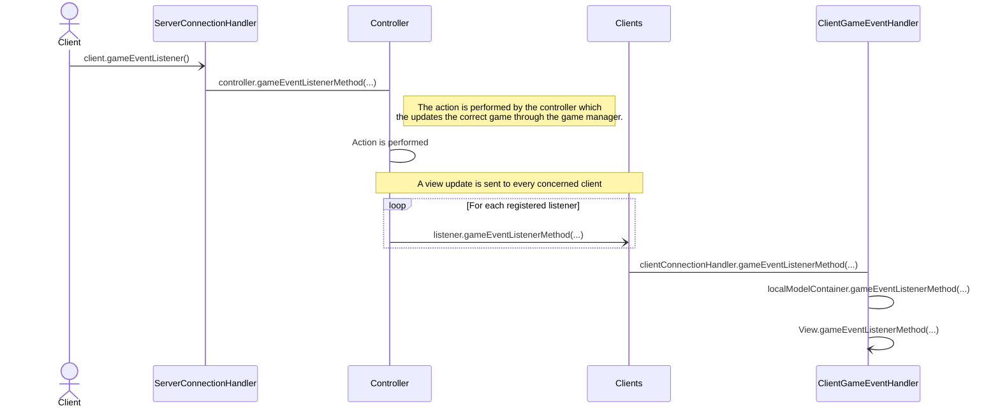
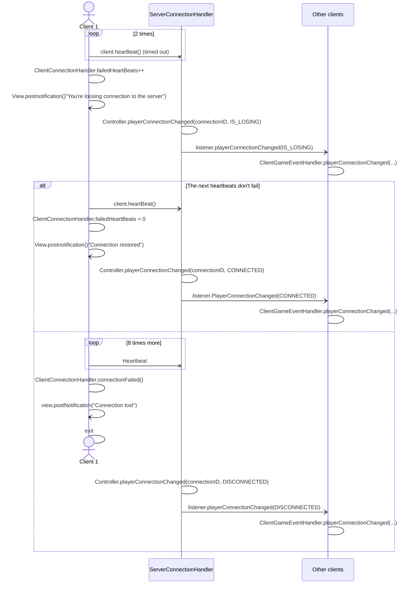
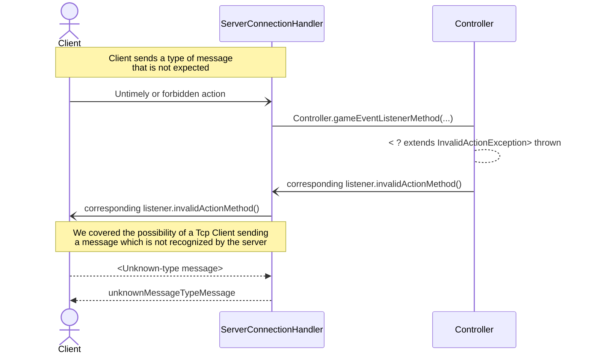
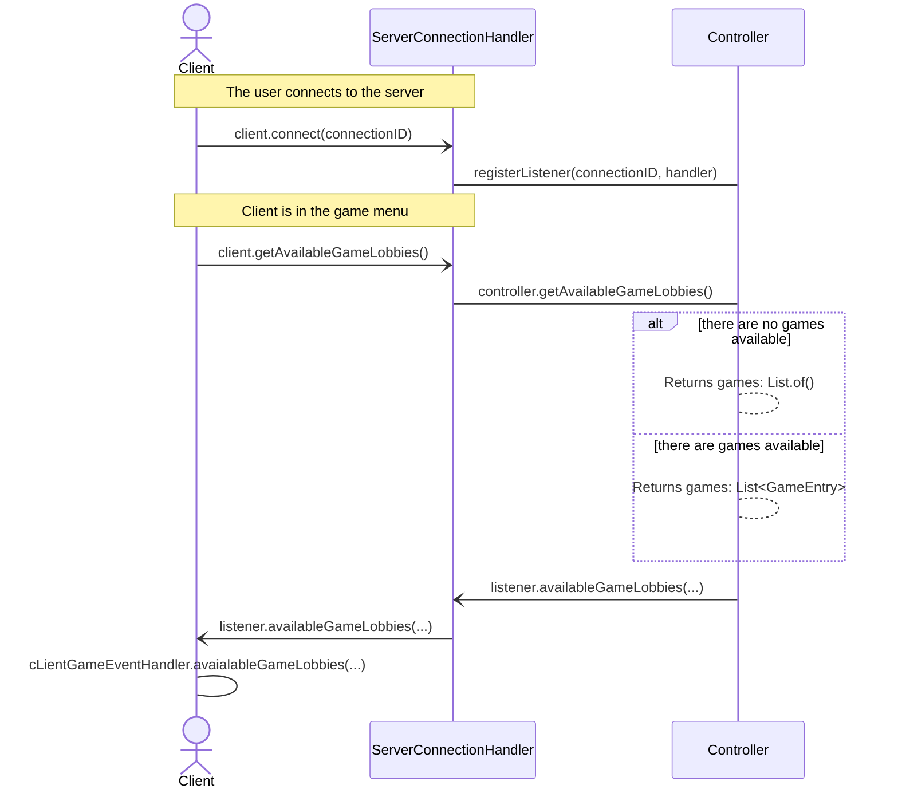
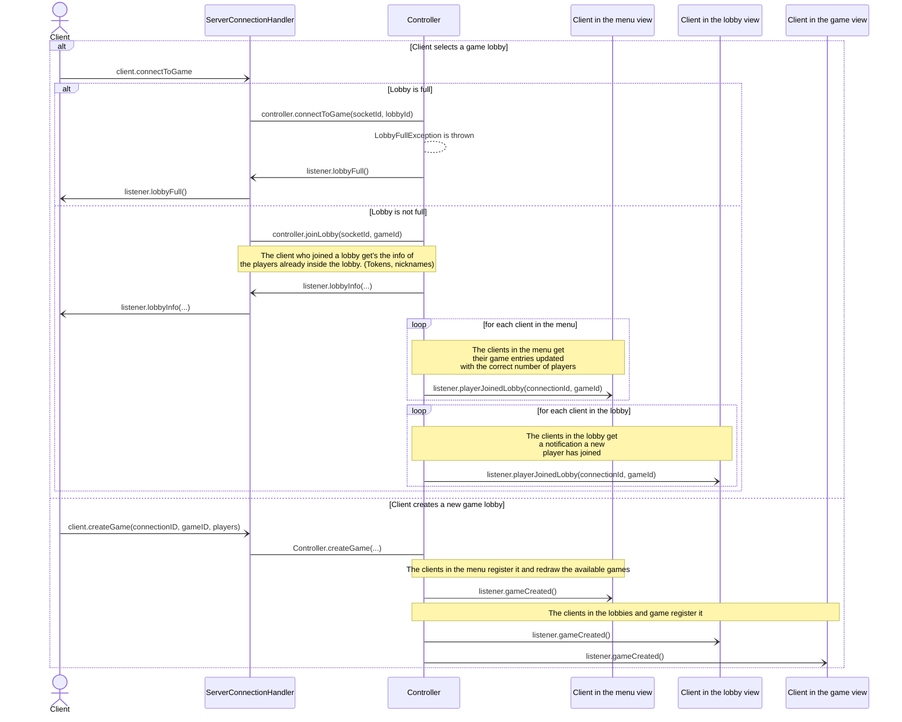
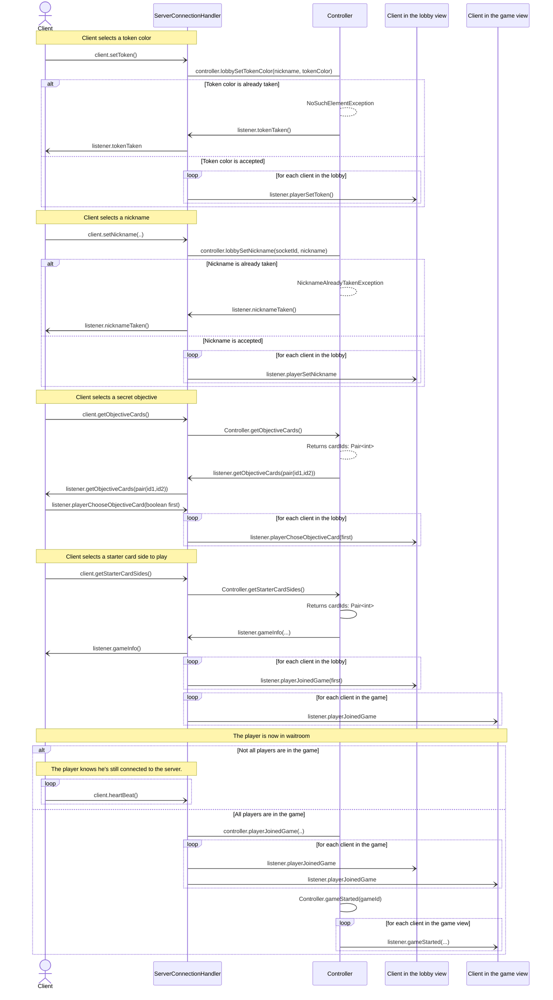
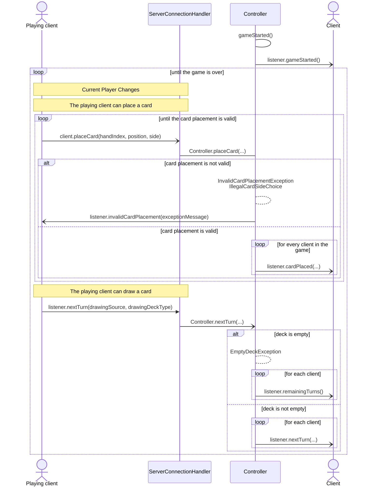
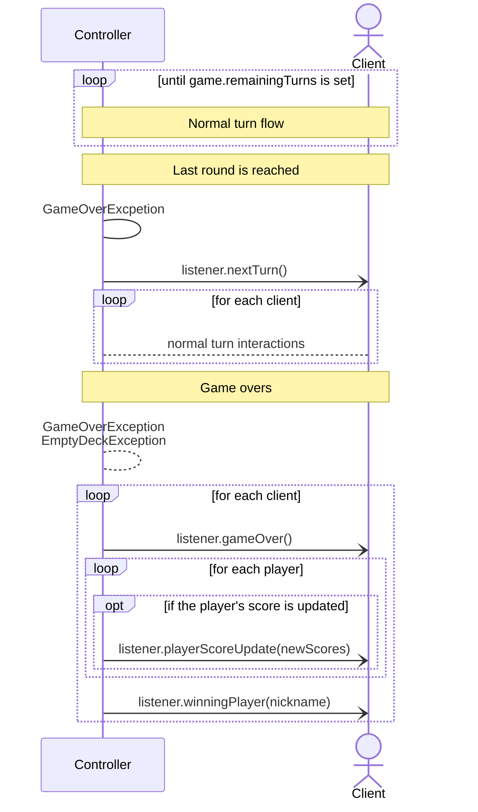
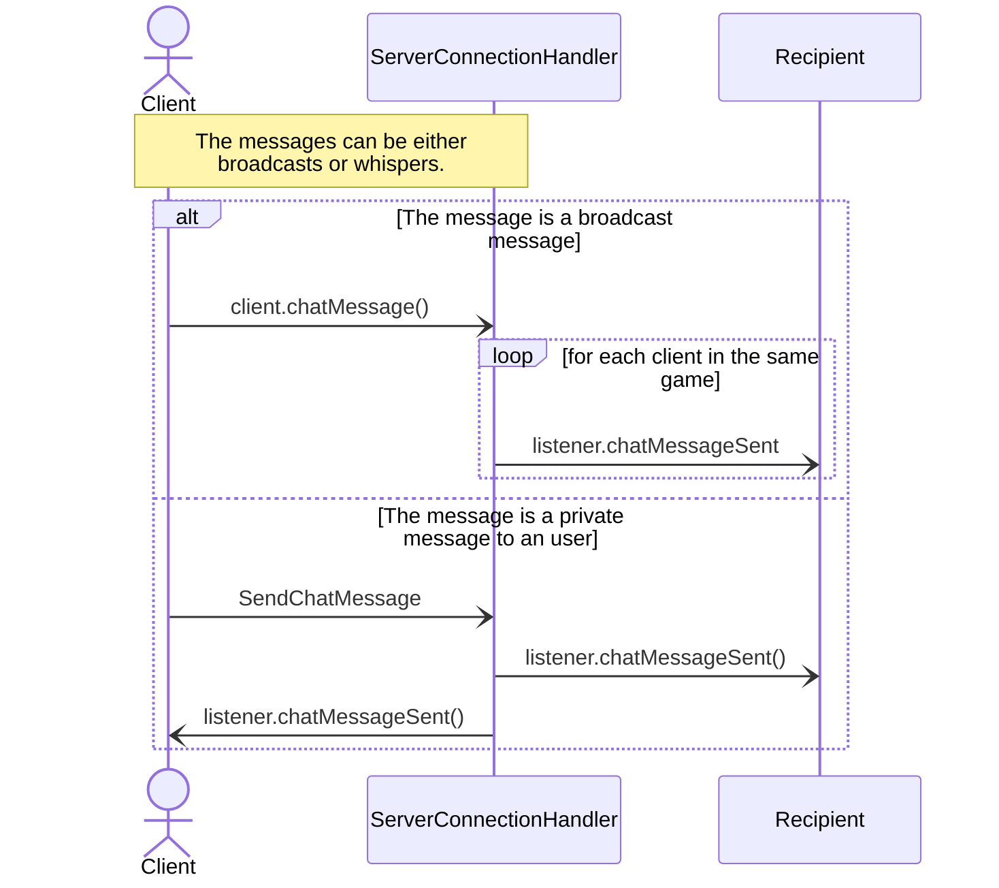

# Network Protocol
The network protocol we designed is meant to be implemented with both RMI and Client-Server Socket functionality.
Both client and server are equipped with listeners which implement the same interface to ask the controller to update the game, the clients to communicate the updates and the `ClientGameEventHandler`s to update every client's status and `View`. 

## General message handling 

### Client Action general handling
The following diagram reports a general rapresentation of our architecture's interactions when a `ClientAction` is sent to the server and an update is sent back to the concerned clients.

Both in client and server we set up listeners implementing the `RemoteGameEventListener` class or the `GameEventListener` (which extends it but does not throw `RemoteException`). This allows us to require all clients to process all the `GameEvents`. 

As for the client listeners, the `RMICLientConnectionHandler` calls the omonymous methods in the Controller, while the `TCPClientConnectionHandler` method implementation send a message to the server which is parsed calling the same methods in the controller. 

As for the server listeners, we have every `RMIClientConnectionHandler` reference and every `TCPServerConnectionHandler` object registered in the server handling the connection with the client by invoking directly a method of the `ClientGameEventHandler` in the case of RMI, or sending a message which will be parsed by the `TCPCLientConnectionHandler` which will call the `ClientGameEventHandler` in the case of TCP. 

In the following diagram we report a general rapresentation using `gameEventListenerMethod()` as an alias for a generic method.

### Failed connection handling
After a connection is enstablished, the client starts sending regular heartbeats. After two missed heartbeats the client loosing connection's `ClientConnectionHandler` notifies the user while the other clients are notified by the server. The client is considered disconnected after 10 missed heartbeats.

As described above (but omitted in the following diagram), `ClientGameEventHandler` updates the `LocalModelContainer` synchronously and the view aynchronously.

### "Not allowed" message handling
In the event a client sends a message for an action that the server which is untimely for the user's context  or that they cannot perform in that moment, and in the event a client might be modified or 'enhanced' in a way the server does not contemplate, we have messages in place to send to the aforesaid client. 

Client's side the error's are parsed by the `ClientGameEventHandler` which implements the `GameErrorListener` interface.

Since updates are only register by the local model once the server validates them only the `View` implements the class as the errors need only to be notified to the users. 

## Game Dynamics' Flows
### Connection and menu flow
As the user connects to the server, a `UUID` identifying the user's client connection is sent to the server and a listener is registered attached to that UUID.
The user then asks for the available games at the moment and the server responds with a list of game entries, containing the gameId, the current number of players and maximum number of players, which are displayed in the menu.

### Lobby Flow
The player building process requires a series of essential steps, which are reported in the following sequence diagram.

For the sake of Semplicity we omit the `ServerConnectionHandler` and Listener actors. The architecture remains the same as described above.
The `GameEventListener` method implentations of the `Controller` class call the methods omonymous the listeners which send an update the client.

#### Selecting or creating a game

#### Player Setup Process

### Normal game turns flow 
Until `Game.nextTurn()` detects that a player has a winning score, the messages between the server and the clients are exchanged as follows.

As before, other than the `ConfirmMessage`, we have a series of messages whose recipients are all the clients in the game. They are used to update the views of the clients and to notify them of the status of the player turn.

### Game over flow
When `controller.nextTurn()` detects that a player has a winning score or an `EmptyDeckException` is caught by the controller, all the clients are notified of the number of remaining rounds.

After the final rounds are played, the server will notify the clients the final scores after the objectives are evaluated and the winning player nickname.

## Advanced Features
### Chat
The chat feature works similarly to the other view updates. Every view update is sent to the concerned clients present in the `ChatMessage` object. 

