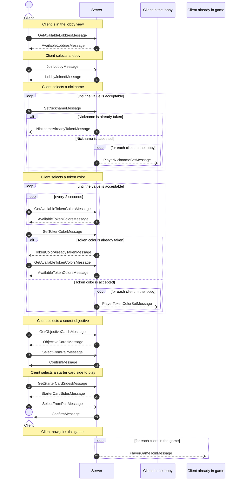

# Network Protocol
The network protocol we designed is meant to be implemented with both RMI and Client-Server Socket functionality.
Both client and server are equipped with a message parser and a set of RMI interfaces which are meant to update the views in the client and call controller methods to update the model in the server.

## Notes on RMI 
In this documentation, only Socket Messages are rapresented as there is duality in the two approaches since every message corresponds to a remote method invocation.

### Player Lobby Flow
As the Player building process is divided in essential and sequantial steps, every message different from the last one received is meant to be accepted as a confirm the last phase was successful and that the client can move forward.

## Normal game turns flow 
During the game, every Game and Player status change is notified to all clients so that a popup or a text message can appear in the view and the client can better follow the flow of the game. 
After every player move, the server sends a message to all the clients.
This message confirms to the client that the previous message has been handled correctly and notifies all the other clients of the update

## Game over flow
The game flows until an GameOverException is caught by the controller. In that case the game enters a GameOver state;

## Not-allowed messages handling
In the event a player tries to place cards or draw in a turn that isn't his or in the event a client might be modified or 'enhanced' in a way the server nor the game contemplate, we have messages in place to send to the  aforesaid client. 

## Chat
This comunication happen when a player(Client) want to write a message in the chat. They send the postMessage to the Server that will notify the player that the message has been received and posted; later it will send a notification to all the other players(Recipient) that there is a new message in the chat.

