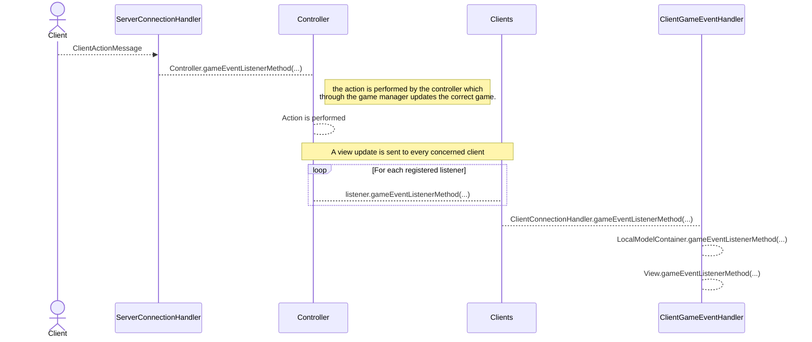
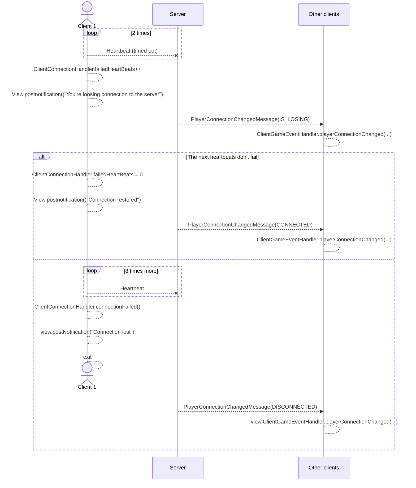
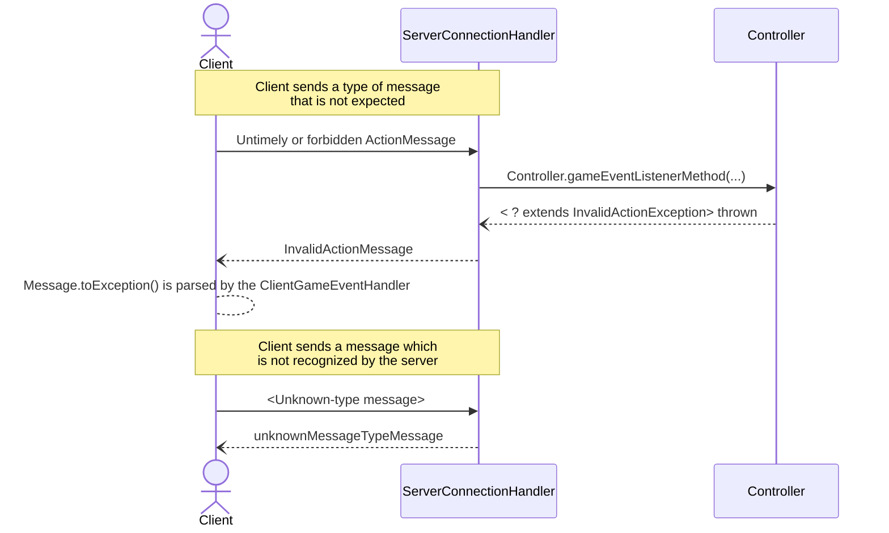
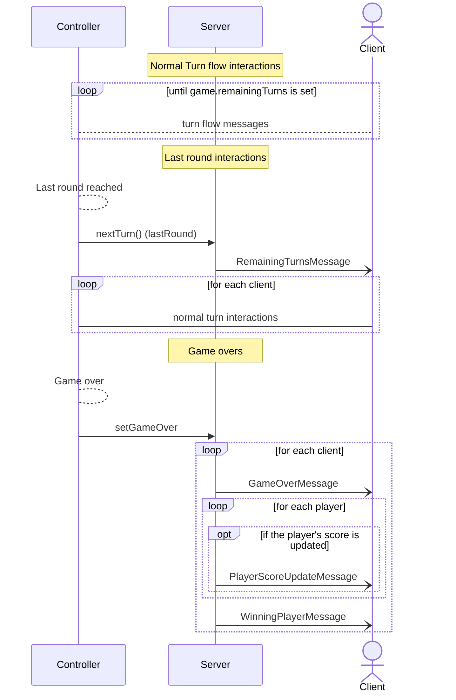
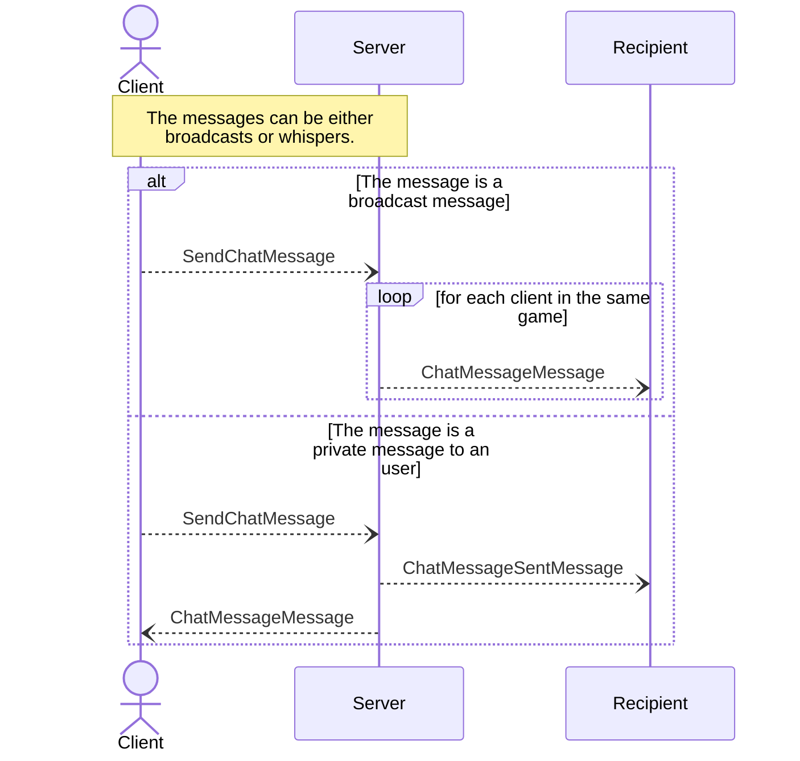

# Network Protocol
The network protocol we designed is meant to be implemented with both RMI and Client-Server Socket functionality.
Both client and server are equipped with a message parser for serialized Java objects sent through the network and a set of RMI interfaces which are meant to update the views in the client and call controller methods to update the model in the server.

## Notes on RMI 
In this documentation only Socket messages are represented, as there is duality in the two approaches since every message corresponds to a remote method invocation.

## General message handling 

### Client Action message handling
The following diagram reports a general rapresentation of our architecture's flow when a ClientAction is sent to the server.
The **listener  classes** calling `gameEventListenerMethods(...)` implement either the `RemoteGameEventListener` class or the `GameEventListener` which extends it and does not throw `RemoteException`. 

Note: for listener we mean every `RMIClientConnectionHandler`'s reference and every `TCPServerConnectionHandler` object saved for every client, which handle the connection with the client. 

### Failed connection handling
After a connection is enstablished, the client starts sending regular heartbeats. After two missed heartbeats the client loosing connection's `ClientConnectionHandler` notifies the user while the other clients are notified by the server. The client is considered disconnected after 10 missed heartbeats.

The one reported is a simplified view with less actors, the architecture is the same as described above.

### "Not allowed" message handling
In the event a client sends a message for an action that the server which is untimely for the user's context  or that they cannot perform in that moment, and in the event a client might be modified or 'enhanced' in a way the server does not contemplate, we have messages in place to send to the aforesaid client. 

Client's side the error's are parsed by the `ClientGameEventHandler` which implements the `GameErrorListener` interface.

Since updates are only register by the local model once the server validates them only the `View` implements the class as the errors need only to be notified to the users. 

## Game Dynamics' Flows
### Lobby Flow
The player building process requires a series of essential steps, which are reported in the following sequence diagram.

Other than `ConfirmMessage`, which is required by the client to confirm the message has been received and handled correctly, we added a series of messages whose recipients are all the clients in the lobby or in the game. They are used to update the views of the clients and to notify them of the status of the lobby.

### Normal game turns flow 
Until `Game.nextTurn()` detects that a player has a winning score, the messages between the server and the clients are exchanged as follows.

As before, other than the `ConfirmMessage`, we have a series of messages whose recipients are all the clients in the game. They are used to update the views of the clients and to notify them of the status of the player turn.

### Game over flow
When `Game.nextTurn()` detects that a player has a winning score or an `EmptyDeckException` is caught by the controller, a message is sent to all the clients to notify them of the number of remaining rounds.

After the final rounds are played, the server will send a series of messages to all the clients to notify them that the game is over and update the final scores of the players after adding the objective cards' points.

## Advanced Features
### Chat
The chat feature works similarly to the other view updates. Every view update is sent to the concerned clients present in the `ChatMessage` object. 

