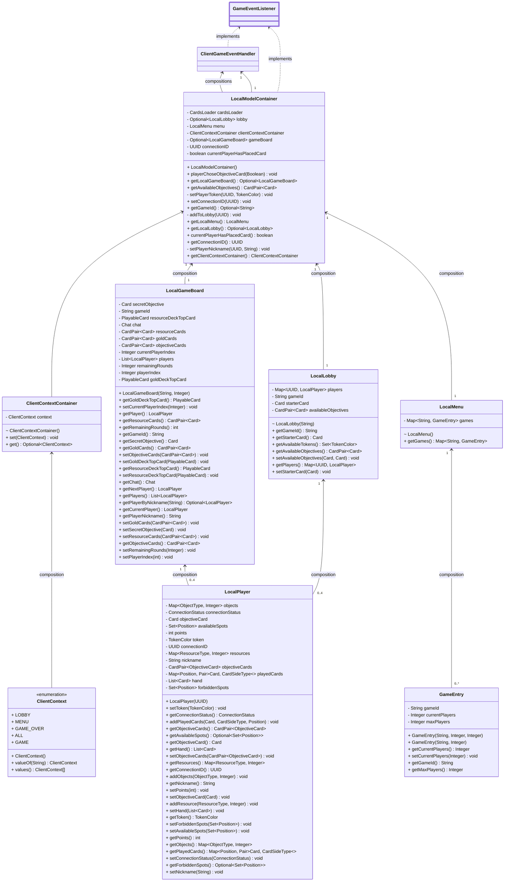

## Client's local model
Since the game model is quite complex, we decided to split the model implementations between the server and the client. The client's model is a simplified version of the server's model, which is merely used to save the current status of the game to update the view whenever is necessary.
The local model Updates are triggered by the `ClientConnectionHandler` methods, which implement the `(Remote)GameEventListener` interface, the `ClientGameEventHandler` class is responsible for handling the events and updating the local model and the view accordingly through the same interface methods.

## View 
For the sake of completeness we also include the autogenerated uml diagram of the View classes. 

```mermaid
classDiagram
direction BT
class Cli {
  + Cli() 
  - LocalModelContainer localModel
  ~ Options options
  + printPrompt() void
  + displayException(Exception) void
  + drawHand() void
  + postNotification(Notification) void
  + drawGame() void
  + postNotification(NotificationType, String) void
  + drawLobby() void
  ~ diffMessage(int, Colorable) void
  + listGames() void
  ~ diffMessage(int, String) void
  + lobbyInfo(LobbyUsersInfo) void
  + drawCardDecks() void
  + drawStarterCardSides() void
  + drawObjectiveCardChoice() void
  + getStarterCard(Integer) void
  + drawLeaderBoard() void
  + drawChatMessage(ChatMessage) void
  + drawGameOver() void
  + postNotification(NotificationType, String[], Colorable, int) void
  + drawCard(Card) void
  + drawGameBoard() void
  + drawCommonObjectiveCards() void
  + playerScoresUpdate(Map~String, Integer~) void
  + playerJoinedLobby(String, UUID) void
  + getLocalModel() LocalModelContainer
  + drawNicknameChoice() void
  + drawAvailableGames() void
  + drawPairs() void
  + drawPlayerObjective() void
  + cardPlaced(String, String, Integer, Integer, CardSideType, Position, int, Map~ResourceType, Integer~, Map~ObjectType, Integer~, Set~Position~, Set~Position~) void
  + getObjectiveCards(Pair~Integer, Integer~) void
  + drawPlayerBoards() void
  + setClient(ClientConnectionHandler) void
  + drawAvailableTokenColors() void
  + printUpdate(String) void
  + drawPlayerBoard(String) void
}
class CliCard {
<<Interface>>
  + cardToString() String
  + cardToAscii(HashMap~Integer, String~) String
  + cardToAscii() String
  + playableCardToAscii(HashMap~Integer, String~) String
}
class CliClient {
  + CliClient() 
  ~ Cli cli
  ~ Scanner scanner
  - List~CommandHandler~ commandHandlers
  - initializeCommandHandlers() void
  - getClientContextContainer() ClientContextContainer
  + start(ConnectionType, String, int) void
  + main(String[]) void
}
class CliUtils {
  + CliUtils() 
  + getColorableLength(Colorable, int, ColorStyle) int
  + colorizeAndCenter(List~T~, int, char, ColorStyle) String
  + colorize(String, Color, ColorStyle) String
  + colorize(T, ColorStyle) String
  + getTable(String[], ArrayList~String~[]) String
  + joinMinLines(String, String) String
  + colorize(T, ColorStyle, int) String
}
class Color {
<<enumeration>>
  - Color(String, String, String, String, String) 
  +  RED
  +  GRAY
  +  BLUE
  +  GREEN
  +  WHITE
  + String bright
  + String background
  +  YELLOW
  +  BLACK
  + String bold
  +  PURPLE
  +  CYAN
  + String underlined
  +  RESET
  + String normal
  + values() Color[]
  + getCode(ColorStyle) String
  + valueOf(String) Color
  + colorize(String, Color, ColorStyle) String
}
class ColorStyle {
<<enumeration>>
  + ColorStyle() 
  +  BACKGROUND
  +  BRIGHT
  +  BOLD
  +  NORMAL
  +  UNDERLINED
  + valueOf(String) ColorStyle
  + values() ColorStyle[]
}
class Colorable {
<<Interface>>
  + getColor() Color
}
class CommandHandler {
  + CommandHandler(String, String, ClientContext, Boolean) 
  + CommandHandler(String, String, ClientContext) 
  - String usage
  - ClientContext context
  - Boolean skipUsageCheck
  - String description
  + handle(String[]) void
  + getDescription() String
  + matchUsageString(String) boolean
  + getContext() Optional~ClientContext~
  + getUsage() String
}
class DraggableLayout {
  + DraggableLayout() 
  - double yOffset
  - double xOffset
  + setDraggable(Stage) void
  + setDraggable(Stage, Node) void
}
class ExceptionLayout {
  + ExceptionLayout() 
  - Text exceptionTitle
  ~ Node exceptionContainer
  - VBox exceptionMessageVBox
  - Button exceptionCloseButton
  ~ Parent exceptionLayout
  + setDraggable(Stage) void
  - loadException() void
  + loadExceptionDetails(Exception) void
  + getParent() Parent
}
class ExceptionLoader {
  + ExceptionLoader(Stage) 
  - Stage exceptionStage
  + loadException(Exception) void
  - showException(ExceptionLayout) void
}
class GridCell {
  + GridCell(Runnable, Supplier~Boolean~) 
  + int CELL_WIDTH
  - GridCellStatus status
  + int TARGET_WIDTH
  + int TARGET_HEIGHT
  + int CELL_HEIGHT
  + setStatus(GridCellStatus) void
  + placeCard(ImageView) void
}
class GridCellStatus {
<<enumeration>>
  + GridCellStatus() 
  +  INACTIVE
  +  FORBIDDEN
  +  AVAILABLE
  + valueOf(String) GridCellStatus
  + values() GridCellStatus[]
}
class Gui {
  + Gui() 
  - CountDownLatch isInitializedLatch
  - Scene scene
  - Stage primaryStage
  - NotificationLoader notificationLoader
  - ExceptionLoader exceptionLoader
  - String visibleUserNickname
  - ClientConnectionHandler client
  - LocalModelContainer localModel
  - CardSideType visibleHandSide
  - Integer selectedHandIndex
  - Gui gui
  - RulebookHandler rulebookHandler
  + drawGameOver() void
  + getLocalModel() LocalModelContainer
  + playerSetToken(String, UUID, String, TokenColor) void
  + drawCardDecks() void
  + getIsInitializedLatch() CountDownLatch
  - getCellClickHandler(Position) Runnable
  + gameDeleted(String) void
  + drawResourcesAndObjects(LocalPlayer) void
  + winningPlayer(String) void
  + displayException(Exception) void
  - updateGameBoardDrawAbility() void
  + playerSetNickname(String, UUID, String) void
  + drawHand() void
  + remainingRounds(String, int) void
  - loadGameEntry(GameEntry) Node
  + drawCommonObjectiveCards() void
  - loadImage(GuiElement) ImageView
  + drawStarterCardSides() void
  + start(Stage) void
  + drawPlayerBoards() void
  + getObjectiveCards(Pair~Integer, Integer~) void
  + gameCreated(String, int, int) void
  + playerLeftLobby(String, UUID) void
  - wrapAndBorder(ImageView) HBox
  + postNotification(NotificationType, String) void
  + lobbyInfo(LobbyUsersInfo) void
  + drawGameBoard() void
  + getStarterCard(Integer) void
  + getInstance() Gui
  + drawGame() void
  - drawGameWindow() void
  - loadSceneFXML(String, String) void
  + drawAvailableGames() void
  + chatMessage(String, ChatMessage) void
  - canPlayerPlaceCards() boolean
  - drawForbiddenPositions(Set~Position~, GridPane) void
  - toggleHandSide() void
  + gameStarted(String, GameInfo) void
  - drawAvailablePositions(Set~Position~, GridPane) void
  + drawChatMessage(ChatMessage) void
  + drawLeaderBoard() void
  + gameOver() void
  + drawObjectiveCardChoice() void
  + drawChat() void
  + playerConnectionChanged(UUID, String, ConnectionStatus) void
  + drawPlayerObjective() void
  + drawAvailableTokenColors() void
  - getCellPlacementActive() Supplier~Boolean~
  + playerScoresUpdate(Map~String, Integer~) void
  + main(String[]) void
  + postNotification(Notification) void
  + playerJoinedLobby(String, UUID) void
  + setClient(ClientConnectionHandler) void
  + drawLobby() void
  + listGames() void
  + playerChoseObjectiveCard(String, UUID, String) void
  + drawCard(Card) void
  + drawPairs() void
  - loadCardImage(Card, CardSideType) ImageView
  - canPlayerDrawCards() boolean
  - loadImage(String) ImageView
  + postNotification(NotificationType, String[], Colorable, int) void
  + drawPlayerBoard(String) void
  + drawNicknameChoice() void
}
class GuiClient {
  + GuiClient() 
  - Gui gui
  + main(String[]) void
  + start(ConnectionType, String, int) void
}
class GuiElement {
<<Interface>>
  + getImagePath() String
  + getBasePath() String
}
class GuiUtils {
  + GuiUtils() 
  + getColorClass(ResourceType) String
}
class Notification {
<<enumeration>>
  - Notification(NotificationType, String) 
  +  MESSAGE_NOT_SENT
  - String message
  - NotificationType notificationType
  +  UNKNOWN_MESSAGE
  +  CONNECTION_ESTABLISHED
  +  ALREADY_WAITING
  +  CONNECTION_FAILED
  +  UNKNOWN_RESPONSE
  + getNotificationType() NotificationType
  + valueOf(String) Notification
  + getMessage() String
  + values() Notification[]
}
class NotificationLayout {
  + NotificationLayout() 
  ~ Parent notificationLayout
  ~ Node notificationContainer
  ~ ProgressBar progressBar
  ~ Text notificationText
  + startProgressBar(int, boolean) void
  + setDraggable(Stage) void
  - loadNotification() void
  + getParent() Node
  - setNotificationType(NotificationType) void
  - setNotificationText(String) void
}
class NotificationLoader {
  + NotificationLoader(Stage) 
  - Stage notificationStage
  - Queue~NotificationLayout~ notifications
  + processNotifications() void
  + addNotification(NotificationType, String) void
}
class NotificationType {
<<enumeration>>
  + NotificationType() 
  +  UPDATE
  +  CONFIRM
  +  WARNING
  +  ERROR
  +  RESPONSE
  + getColor() Color
  + valueOf(String) NotificationType
  + values() NotificationType[]
  + getStyleClass() String
}
class Options {
  + Options(Boolean) 
  - Boolean colored
  + isColored() Boolean
}
class RulebookHandler {
  + RulebookHandler(Stage) 
  - Stage rulebookStage
  - RulebookLayout rulebookLayout
  - showRulebook() void
  + loadRulebook() void
}
class RulebookLayout {
  + RulebookLayout() 
  ~ Node rulebookContainer
  - List~Image~ pages
  - int currentPage
  - HBox pageContainer
  - ImageView page
  ~ Parent rulebookLayout
  + closeRulebook() void
  + getParent() Parent
  - handleNextPage() void
  + loadRulebookDetails() void
  - updatePageView() void
  + setDraggable(Stage) void
  + loadRulebook() void
  - handlePreviousPage() void
}
class View {
<<Interface>>
  + setClient(ClientConnectionHandler) void
  + gameDeleted(String) void
  + refreshLobbies(Set~String~, Map~String, Integer~, Map~String, Integer~) void
  + changeTurn(String, String, Integer, Boolean, DrawingCardSource, DrawingDeckType, Integer, Integer, Set~Position~, Set~Position~, Integer, Integer) void
  + drawPlayerObjective() void
  + getStarterCard(Integer) void
  + drawPlayerBoard() void
  + drawCommonObjectiveCards() void
  + playerSetToken(String, UUID, String, TokenColor) void
  + drawAvailableTokenColors() void
  + winningPlayer(String) void
  + lobbyInfo(LobbyUsersInfo) void
  + drawStarterCardSides() void
  + drawCardDecks() void
  + playerSetNickname(String, UUID, String) void
  + drawCard(Card) void
  + drawGame() void
  + postNotification(NotificationType, String[], Colorable, int) void
  + playerConnectionChanged(UUID, String, ConnectionStatus) void
  + playerJoinedGame(String, UUID, String, TokenColor, List~Integer~, Integer, CardSideType) void
  + chatMessage(String, ChatMessage) void
  + drawObjectiveCardChoice() void
  + drawPlayerBoards() void
  + playerLeftLobby(String, UUID) void
  + drawLobby() void
  + listGames() void
  + drawGameOver() void
  + gameCreated(String, int, int) void
  + drawNicknameChoice() void
  + drawHand() void
  + displayException(Exception) void
  + gameStarted(String, GameInfo) void
  + getObjectiveCards(Pair~Integer, Integer~) void
  + drawLeaderBoard() void
  + getLocalModel() LocalModelContainer
  + drawPairs() void
  + cardPlaced(String, String, Integer, Integer, CardSideType, Position, int, Map~ResourceType, Integer~, Map~ObjectType, Integer~, Set~Position~, Set~Position~) void
  + changeTurn(String, String, Integer, Boolean, Set~Position~, Set~Position~, Integer, Integer) void
  + playerScoresUpdate(Map~String, Integer~) void
  + drawAvailableGames() void
  + postNotification(Notification) void
  + playerChoseObjectiveCard(String, UUID, String) void
  + remainingRounds(String, int) void
  + drawGameBoard() void
  + postNotification(NotificationType, String) void
  + gameOver() void
  + playerJoinedLobby(String, UUID) void
  + drawChatMessage(ChatMessage) void
  + drawPlayerBoard(String) void
}
class ViewClient {
  + ViewClient(View) 
  # View view
  # ClientConnectionHandler client
  - CountDownLatch isInitializedLatch
  # ClientGameEventHandler gameEventHandler
  # getIsInitializedLatch() CountDownLatch
  + start(ConnectionType, String, int) void
}
class ViewGridPosition {
  + ViewGridPosition(int, int) 
  + ViewGridPosition(Position) 
  - int row
  + int gridSize
  - int col
  + getRow() int
  + getCol() int
  + getModelPosition() Position
}

Cli  ..>  View 
CliClient  -->  ViewClient 
CliClient  -->  CommandHandler 
ExceptionLayout  -->  DraggableLayout 
ExceptionLoader  -->  ExceptionLayout 
Gui  ..>  View 
GuiClient  -->  ViewClient 
NotificationLayout  -->  DraggableLayout 
NotificationLoader  -->  NotificationLayout 
NotificationType  ..>  Colorable 
Cli  -->  Options 
RulebookLayout  -->  DraggableLayout 
RulebookHandler  -->  RulebookLayout 
```

