## General architecture of the application

The following diagram shows the general architecture of the application. The `Main` class is the entry point of the application. It is responsible for parsing the command line arguments and starting the client or server accordingly. 

```mermaid
classDiagram
  direction TB 


class Main {
  + Main() 
  ~ printAsciiArt() void
  + main(String[]) void
  - startClient(String, ClientType, ConnectionType, Integer) void
  - printHelp() void
  - startServer(Integer, Integer) void
}

class AbstractServer {
  # AbstractServer(Integer, GameController) 
  # GameController controller
  # CountDownLatch serverReadyLatch
  + getServerReadyLatch() CountDownLatch
  + stop() void
  + start() void
}

class ClientGameEventHandler {
  + ClientGameEventHandler(View, LocalModelContainer) 
  - RemoteGameEventListener listener
  # LocalModelContainer localModel
  + handleInvalidActionException(InvalidActionException) void
  + getView() View
  + getRemoteListener() RemoteGameEventListener
}
class ClientType {
<<enumeration>>
  + ClientType() 
  +  GUI
  +  CLI
  + valueOf(String) ClientType
  + values() ClientType[]
}
class ConnectionType {
<<enumeration>>
  + ConnectionType() 
  +  TCP
  +  RMI
  + valueOf(String) ConnectionType
  + values() ConnectionType[]
  + getDefaultPort() int
}


class Cli {
  + Cli() 
  - LocalModelContainer localModel
  ~ Options options
  + printPrompt() void
  ~ diffMessage(int, Colorable) void
  ~ diffMessage(int, String) void
  + printUpdate(String) void
}
class CliClient {
  + CliClient() 
  ~ Cli cli
  ~ Scanner scanner
  - List~CommandHandler~ commandHandlers
  - initializeCommandHandlers() void
  - getClientContextContainer() ClientContextContainer
  + start(ConnectionType, String, int) void
  + main(String[]) void
}


class CommandHandler {
  + CommandHandler(String, String, ClientContext, Boolean) 
  + CommandHandler(String, String, ClientContext) 
  - String usage
  - ClientContext context
  - Boolean skipUsageCheck
  - String description
  + handle(String[]) void
  + getDescription() String
  + matchUsageString(String) boolean
  + getContext() Optional~ClientContext~
  + getUsage() String
}

class GuiClient {
  + GuiClient() 
  - Gui gui
  + main(String[]) void
  + start(ConnectionType, String, int) void
}

class Gui {
  + Gui() 
  - CountDownLatch isInitializedLatch
  - Scene scene
  - Stage primaryStage
  - NotificationLoader notificationLoader
  - ExceptionLoader exceptionLoader
  - String visibleUserNickname
  - ClientConnectionHandler client
  - LocalModelContainer localModel
  - CardSideType visibleHandSide
  - Integer selectedHandIndex
  - Gui gui
  - RulebookHandler rulebookHandler
  + getIsInitializedLatch() CountDownLatch
  - getCellClickHandler(Position) Runnable
  + drawResourcesAndObjects(LocalPlayer) void
  - updateGameBoardDrawAbility() void
  - loadGameEntry(GameEntry) Node
  - loadImage(GuiElement) ImageView
  + start(Stage) void
  - wrapAndBorder(ImageView) HBox
  + getInstance() Gui
  - drawGameWindow() void
  - loadSceneFXML(String, String) void
  - canPlayerPlaceCards() boolean
  - drawForbiddenPositions(Set~Position~, GridPane) void
  - toggleHandSide() void
  - drawAvailablePositions(Set~Position~, GridPane) void
  + drawChat() void
  - getCellPlacementActive() Supplier~Boolean~
  + main(String[]) void
  - loadCardImage(Card, CardSideType) ImageView
  - canPlayerDrawCards() boolean
  - loadImage(String) ImageView
}

class Cli-Options {
  + Options(Boolean) 
  - Boolean colored
  + isColored() Boolean
}
class Main-Options {
  + Options(Boolean) 
  - Boolean debugMode
  + isDebug() Boolean
}
class RMIClientConnectionHandler {
  + RMIClientConnectionHandler(String, Integer, View, ClientGameEventHandler) 
  - RMIServerConnectionHandler rmiConnectionHandler
  - getGameIDWithMessage() Optional~String~
  - handleInvalidActionException(InvalidActionException) void
}
class RMIServer {
  + RMIServer(Integer, GameController) 
  + start() void
  + stop() void
}
class RMIServerConnectionHandler {
  + sendChatMessage(UUID, ChatMessage) void
  + joinLobby(UUID, String) void
  + leaveLobby(UUID) void
  + deleteGame(UUID, String) void
  + lobbySetNickname(UUID, String) void
  + getLobbyObjectiveCards(UUID) Pair~Integer, Integer~
  + getLobbyStarterCard(UUID) Integer
  + createGame(UUID, String, Integer) void
  + heartBeat(UUID) void
  + getGamesCurrentPlayers() Map~String, Integer~
  + lobbySetTokenColor(UUID, TokenColor) void
  + startGame(UUID) void
  + joinGame(UUID, String, CardSideType) void
  + nextTurn(UUID, DrawingCardSource, DrawingDeckType) void
  + getGames() Set~String~
  + nextTurn(UUID) void
  + connect(UUID, RemoteGameEventListener) void
  + getAvailableTokens(String) Set~TokenColor~
  + getGamesMaxPlayers() Map~String, Integer~
  + placeCard(UUID, Integer, CardSideType, Position) void
  + lobbyChooseObjective(UUID, Boolean) void
}
class RMIServerConnectionHandlerImpl {
  + RMIServerConnectionHandlerImpl(GameController) 
  ~ GameController controller
}

class Server {
  + Server(Integer, Integer, GameController) 
  + Server(Integer, Integer) 
  ~ GameController controller
  ~ RMIServer rmiServer
  ~ TCPServer tcpServer
  ~ Integer rmiPort
  ~ Integer tcpPort
  + start() void
  + stop() void
}


Main "1" <-- "1" Server : contains 
Main "1" <-- "1" ViewClient : contains


Server "1" <-- "1" RMIServer  : contains
Server "1" <-- "1" TCPServer : contains

TCPServer "1" <-- "0..*" TCPServerConnectionHandler : contains

RMIServer "1" <-- "0..*" RMIServerConnectionHandler : contains

Server "1" <-- "1" GameController : contains
GameController "1" <-- "1" GameManager : contains


class TCPClientConnectionHandler {
  + TCPClientConnectionHandler(String, int, View, ClientGameEventHandler) 
  - Socket socket
  - ObjectInputStream inputStream
  - ObjectOutputStream outputStream
  - Queue~Message~ incomingMessages
  - Boolean waiting
  - ExecutorService threadManager

  - startMessageHandler() void
  + handleMessage(Message) void
  - getView() View
  - send(ClientMessage, Runnable, Runnable) void
  - send(ClientMessage) void
  - startMessageParser() void
  - getGameIDWithMessage() Optional~String~
}
class TCPServer {
  + TCPServer(Integer, GameController) 
  - ServerSocket serverSocket
  + start() void
  + stop() void
}

class TCPServerConnectionHandler {
  + TCPServerConnectionHandler(Socket, GameController) 
  - Queue~Message~ incomingMessages
  - ObjectOutputStream outputStream
  - ObjectInputStream inputStream
  - Socket socket
  - GameController controller
  - ExecutorService localExecutor
  - TCPServerControllerListener listener
  - startMessageHandler() void
  
  - handleMessage(Message) void
  + broadcast(Message) void
  - closeConnection() void
  + run() void
  - startMessageParser() void
  + send(Message) void
}
class TCPServerControllerListener {
  + TCPServerControllerListener(Consumer~Message~) 
  - Consumer~Message~ broadcast
}
class ViewClient {
  + ViewClient(View) 
  # View view
  # ClientType clientType
  # ClientConnectionHandler client
  # ConnectionType connectionType
  - CountDownLatch isInitializedLatch
  # getIsInitializedLatch() CountDownLatch
  + start(ConnectionType, String, int) void
}

class RemoteGameEventListener {
<<Interface>>
  + remainingRounds(String, int) void
  + lobbyInfo(LobbyUsersInfo) void
  + playerConnectionChanged(UUID, String, ConnectionStatus) void
  + winningPlayer(String) void
  + playerSetToken(String, UUID, String, TokenColor) void
  + playerScoresUpdate(Map~String, Integer~) void
  + getStarterCard(Integer) void
  + playerLeftLobby(String, UUID) void
  + playerSetNickname(String, UUID, String) void
  + refreshLobbies(Set~String~, Map~String, Integer~, Map~String, Integer~) void
  + changeTurn(String, String, Integer, Boolean, DrawingCardSource, DrawingDeckType, Integer, Integer, Set~Position~, Set~Position~, Integer, Integer) void
  + gameOver() void
  + playerJoinedGame(String, UUID, String, TokenColor, List~Integer~, Integer, CardSideType) void
  + gameDeleted(String) void
  + gameStarted(String, GameInfo) void
  + playerJoinedLobby(String, UUID) void
  + playerChoseObjectiveCard(String, UUID, String) void
  + cardPlaced(String, String, Integer, Integer, CardSideType, Position, int, Map~ResourceType, Integer~, Map~ObjectType, Integer~, Set~Position~, Set~Position~) void
  + gameCreated(String, int, int) void
  + chatMessage(String, ChatMessage) void
  + getObjectiveCards(Pair~Integer, Integer~) void
  + changeTurn(String, String, Integer, Boolean, Set~Position~, Set~Position~, Integer, Integer) void
}

class GameErrorListener {
<<Interface>>
  + gameNotFound(String) void
  + tokenTaken(TokenColor) void
  + gameNotStarted() void
  + nicknameTaken(String) void
  + gameNotReady() void
  + illegalCardSideChoice() void
  + invalidTokenColor() void
  + gameOver() void
  + gameAlreadyExists(String) void
  + playerNotActive() void
  + playerNotFound() void
  + notInLobby() void
  + alreadyPlacedCard() void
  + unknownResponse() void
  + invalidNextTurnCall() void
  + incompleteLobbyPlayer(String) void
  + emptyDeck() void
  + gameAlreadyStarted() void
  + lobbyFull(String) void
  + invalidCardPlacement(String) void
  + invalidGetObjectiveCardsCall() void
  + cardNotPlaced() void
  + notInGame() void
}

class View {
<<Interface>>
  + setClient(ClientConnectionHandler) void
  + drawPlayerObjective() void
  + drawPlayerBoard() void
  + drawCommonObjectiveCards() void
  + drawAvailableTokenColors() void
  + drawStarterCardSides() void
  + drawCardDecks() void
  + drawCard(Card) void
  + drawGame() void
  + postNotification(NotificationType, String[], Colorable, int) void
  + drawObjectiveCardChoice() void
  + drawPlayerBoards() void
  + drawLobby() void
  + listGames() void
  + drawGameOver() void
  + drawNicknameChoice() void
  + drawHand() void
  + displayException(Exception) void
  + drawLeaderBoard() void
  + getLocalModel() LocalModelContainer
  + drawPairs() void
  + drawAvailableGames() void
  + postNotification(Notification) void
  + drawGameBoard() void
  + postNotification(NotificationType, String) void
  + drawChatMessage(ChatMessage) void
  + drawPlayerBoard(String) void
}

class ClientConnectionHandler {
  + ClientConnectionHandler(String, Integer, View, ClientGameEventHandler) 
  # Integer port
  - Integer consecutiveFailedHeartBeats
  - View view
  - ConnectionStatus connectionStatus
  # String host
  # ConnectionType connectionType
  # UUID connectionID
  # ClientGameEventHandler gameEventHandler
  + lobbySetToken(TokenColor) void
  + getObjectiveCards() void
  + leaveLobby() void
  + lobbyChooseObjectiveCard(Boolean) void
  + lobbyJoinGame(CardSideType) void
  + heartBeat(Runnable, Runnable) void
  + getConnectionType() ConnectionType
  + isConnected() Boolean
  + getStarterCard() void
  + connect() void
  - disconnected() void
  + connectionFailed(Exception) void
  ~ getView() View
  + nextTurn() void
  + leaveGameLobby() void
  + connectionEstablished() void
  + lobbySetNickname(String) void
  + isLosing() Boolean
  + connectToGame(String) void
  + createGame(String, int) void
  + messageNotSent() void
  + disconnect() void
  + createAndConnectToGame(String, int) void
  # getConnectionID() UUID
  + sendChatMessage(ChatMessage) void
  + nextTurn(DrawingCardSource, DrawingDeckType) void
  - failedHeartBeat() void
  ~ getLocalModel() LocalModelContainer
  + isConnectedOrLosing() Boolean
  + getGames() void
  + getObjectivesIfNull() void
  + placeCard(Integer, CardSideType, Position) void
}

  View <.. Cli : implements
  View <.. Gui : implements

  GuiClient <-- Gui : contains
  CliClient <-- Cli : contains

  ViewClient <-- CliClient : extends
  ViewClient <-- GuiClient : extends

  ViewClient <-- ConnectionType : uses
  ViewClient <-- ClientType : uses
  ViewClient <-- ClientConnectionHandler : contains

  ViewClient <-- View : contains


  GameErrorListener <.. ClientGameEventHandler : implements
  GameEventListener <.. ClientGameEventHandler : implements
  
  CliClient "1" <-- "1..*"  CommandHandler : contains

  RemoteGameEventListener <-- GameEventListener 
  
  Cli <-- Cli-Options : contains
  Main <-- Main-Options : contains
  
  ClientConnectionHandler <-- RMIClientConnectionHandler : extends
  ClientConnectionHandler <-- TCPClientConnectionHandler : extends


  TCPServer <-- AbstractServer   : extends
  RMIServer <--  AbstractServer  : extends

  RMIServerConnectionHandler <.. RMIServerConnectionHandlerImpl : implements
  
  TCPServerConnectionHandler <-- TCPServerControllerListener: contains  
  GameEventListener <.. TCPServerControllerListener : implements

  GameEventListener <-- View : extends 


  style RemoteGameEventListener stroke:#00,stroke-width:4px
  style GameEventListener stroke:#00,stroke-width:4px
  style View stroke:#00,stroke-width:4px
  style ClientGameEventHandler stroke:#ffbb00,stroke-width:4px
```

