# UML progetto di ingegneria del software

A rough view of the UML of Model View Controller:

- **Model**: will be connected to the server side controller
  - _Game_: enforces the games rhythm, general rules about the game status, calls for turns and rounds, creates the game boards (common and personal), instantiates the players (passing their boards as parameters) and the decks of cards, keeps track of the game state and the game over condition.
  - _Player_: can play a turn (try to play a card on the player board given as parameter to their constructor and receive drawn cards), has points,
    - _Player Board_: enforces rules for card placement and keeps tracks of resources, objets the geometry of the cards placed onto it
  - _Cards hierarchy_: The uml is pretty self explanatory
  - _GameBoard_: composed of (composition class to keep things tidy (is it necessary tho?)
    - _Score Board_: hashmap with buckets, of (lists of) player tokens (optional utility to useful for the GUI development eventually)
    - _Common Board_: common cards for everyone to use, methods to get and draw cards from here (the latter also draws a new card from the deck) (card retrieval methods comprehend common goals retrival for point calculation).
    - _Card's Decks_ : methods to shuffle and retrieve cards from the decks.
    -
- **View**:
  - Cli: text based implementation of the game components for the client
  - Gui: javaFX implementation of the game components for the client
- **Controller**:
  - Client: will handle input received from the respective views and will submit it to the server.
  - Server: will instantiate the game and handle the communications with all the clients.

## Model
As a team, we made the choice to implement part of the game logic in our model because we wanted the controller layer in the server, to be as light as possible. This way the role of the controller layer is to parse the inputs coming from the client controller (communications), calling the model methods to update the game, player, gameboard and playerboard statuses with the parsed data and finally to signal the views to update. 

#### Note on the uml
For development and accessability purposes we split the model class diagram in two parts: the card hierarchy and the rest of the model, so that the most meaningful connections would be easily visibile in the diagram. For the same purpose we deliberately omitted some of the connections between some classes(notably enums) to avoid the graph getting super busy.

#### Documenting choices 
Some design choices we took that we think are worth documenting into detail are:
1. The hybrid approach to evaluating objectives and card placement points: to reflect actual game dynamics we decided to make the cards return a Function which will populated with the playerBoard attributes in the playerBoard context. This way we avoid sending around the playerBoard instances, which we considered a bad practice, and avoid duplicating it just to have the cards evaluate the points with their specificity, which we obtain nonetheless with this approach.      

2. The use of the Builder pattern for the Player class: since the player attributes are all final once chosen by the client, we decided to store PlayerBuilder instances in a hashmap in the Lobby class as the controller layer handles the parsing of the client inputs. This way a player is added to the Game's Player list only when finalized (once they have chosen their Secret Objective).

3. Some classes can be considered redundant as they could be easily implemented as part of the class they are a composition to. We decided to keep them separate to keep the code more readable and to make the implementation of the GUI easier as these entities are effectively functional on their own and can be considered "Drawable". 

### Cards

```mermaid
classDiagram

class ResourceType {
    <<Enumeration>>
    PLANT_KINGDOM
    ANIMAL_KINGDOM
    FUNGI_KINGDOM
    INSECT_KINGDOM

    +toString() String
    +has(Object value) boolean
}

class ObjectType {
    <<Enumeration>>
    QUILL
    INKWELL
    MANUSCRIPT

    +toString() String
    +has(Object value) boolean
}

class CardSideType {
    <<Enumeration>>
    FRONT
    BACK
}

class CornerPosition {
    <<Enumeration>>
    UP_LEFT
    DOWN_LEFT
    UP_RIGHT
    DOWN_RIGHT
}

class Card {
    <<Abstract>>
    -id: int

    Card(int id)

    getId() int
    getEvaluator() Function~PlayerBoard; Integer points~ *
}

class Corner~T~ {
    %%set in the constructor
    -content: Optional~T~
    -isCovered: boolean
    
    Corner()
    Corner(T content)

    isEmpty() bool
    getContent() Optional~T~
    cover() void
}
PlayableSide "1" *-- "1..4" Corner: composition

class PointConditionType {
    <<Enumeration>>
    OBJECTS
    CORNERS
}

class ObjectiveCard {
    -points: int
    -objective: Objective

    ObjectiveCard(int id, int points, Objective objective)

    %% return points * objective.evaluate()
    getEvaluator() Function~PlayerBoard pb; Integer points~ 
    %% implements the abstract method in Card
}

class Objective {
    <<Abstract>>
    getEvaluator() Function~PlayerBoard pb; Integer points~ *
}
ObjectiveCard "1" *-- "1" Objective: composition
Card <|.. ObjectiveCard: realization 

class GeometricObjective {
    -geometry: ResourceType[3][3]

    GeometricObjective(ResourceType[3][3] geometry)

    getEvaluator() Function~PlayerBoard pb; Integer points~
}
Objective <|.. GeometricObjective : realization
%% ResourceType "3..n" <-- "n" GeometricObjective: dependency


class CountingObjective {
    -resources: HashMap~ResourceType; int~
    -objects: HashMap~ObjectType; int~
    
    CountingObjective(HashMap~ResourceType; int~ resources, HashMap~ObjectType; int~ objects)
    
    getEvaluator() Function~PlayerBoard pb; Integer points~
}
Objective <|.. CountingObjective : realization
%% ResourceType "0..4" <-- "n" CountingObjective: dependency
%% ObjectType "0..3" <-- "n" CountingObjective: dependency

class PlayableCard {
    -frontSide: PlayableFrontSide
    -backSide: PlayableBackSide
    -playedSide: CardSideType[0..1]
    -coveredCorners: int
    -kingdom: ResourceType[0..1]

    PlayableCard(int id, PlayableSide front, PlayableSide back)
    PlayableCard(int id, PlayableSide front, PlayableSide back, ResourceType kingdom)

    getKingdom() ResourceType[0..1]
    getPlayedSide() PlayableSide
    setPlayedSide(CardSideType sideType) void
    getCoveredCorners() int
    setCoveredCorners(int n) void
    getEvaluator() Function~PlayerBoard pb; Integer points~
}
Card <|.. PlayableCard: realization
%% CardSideType "0..1" <-- "n" PlayableCard: dependency

class PlayableSide {
    <<Abstract>>
    -corners: Corner[1..4]

    getCorners() Corner[1..4]
    setCorner(CornerPosition position, ResourceType resource)
    setCorner(CornerPosition position, ObjectType object)
    getEvaluator() BiFunction~PlayerBoard pb; Integer coveredCorners; Integer points~ *
}
%% CornerPosition "1..4" <-- "n" PlayableSide: dependency
%% ResourceType "0..4" <-- "n" PlayableSide: dependency
%% ObjectType "0..4" <-- "n" PlayableSide: dependency

class PlayableBackSide {
    -permanentResources: ResourceType[1..3]

    PlayableBackSide(ResourceType[1..3] permanentResources)

    getResources() ResourceType[1..3]
    getEvaluator() BiFunction~PlayerBoard pb; Integer coveredCorners; Integer points~
}
PlayableSide <|.. PlayableBackSide: realization
PlayableCard "1" *-- "1"  PlayableBackSide: composition
%% ResourceType "1..3" <-- "n" PlayableBackSide: dependency

class PlayableFrontSide {
    <<Abstract>>
    getEvaluator() BiFunction~PlayerBoard pb; Integer CoveredCorners; Integer points~ *

}
PlayableSide <-- PlayableFrontSide: inheritance
PlayableCard "1" *-- "1" PlayableFrontSide: composition

class StarterCardFrontSide {
    StarterCardFrontSide()

    getEvaluator() BiFunction~PlayerBoard pb; Integer coveredCorners; Integer points~
}
PlayableFrontSide <|.. StarterCardFrontSide: realization

class ResourceCardFrontSide {
    -points: int

    ResourceCardFrontSide(int points)

    getEvaluator() BiFunction~PlayerBoard pb; Integer coveredCorners; Integer points~

}
PlayableFrontSide <|.. ResourceCardFrontSide: realization

class GoldCardFrontSide {
    -placementCondition: ResourceType[1..5]
    -pointCondition: PointConditionType[0..1]
    -pointConditionObject: ObjectType[0..1]

    GoldCardFrontSide(int points, ResourceType[1..5] placementCondition, PointConditionType[0..1] pointCondition, ObjectType[0..1] pointConditionObject)

    getEvaluator() BiFunction~PlayerBoard pb; Integer coveredCorners; Integer points~
    %%implements the abstract method in PlayableSide
}
ResourceCardFrontSide <|-- GoldCardFrontSide: inheritance
%% ResourceType "1..5" <-- "n" GoldCardFrontSide: dependency
%% PointConditionType "0..1" <-- "n" GoldCardFrontSide: dependency
%% ObjectType "0..1" <-- "n" GoldCardFrontSide: dependency

class CardBuilder {
    -id: int
    %% Resource | Starter | Gold | Objective
    -type: CardType 

    %% Objective | Resource | Gold
    -points: int[0..1]

    %% Objective
    -objectiveType: ObjectiveType[0..1]
    -objectiveGeometry: ResourceType[3][3][0..1]
    -objectiveResources: HashMap~ResourceType, int~[0..1]
    -objectiveObjects: HashMap~ObjectType, int~[0..1]

    %% Resource | Starter | Gold
    -backPermanentResources: ResourceType[1..3][0..1]

    %% Gold
    -placementCondition: ResourceType[1..5][0..1]
    -pointCondition: PointConditionType[0..1]
    -pointConditionObject: ObjectType[0..1]

    CardBuilder(int id, CardType type)

    setPoints(int points) CardBuilder ~~throws~~ WrongCardTypeException

    setObjectiveType(ObjectiveType objectiveType) CardBuilder ~~throws~~ WrongCardTypeException
    setObjectiveGeometry(ResourceType[3][3] objectiveGeometry) CardBuilder ~~throws~~ WrongCardTypeException
    setObjectiveResources(HashMap~ResourceType, int~ objectiveResources) CardBuilder ~~throws~~ WrongCardTypeException
    setObjectiveObjects(HashMap~ObjectType, int~ objectiveObjects) CardBuilder ~~throws~~ WrongCardTypeException

    setBackPermanentResources(ResourceType[1..3] backPermanentResources) CardBuilder ~~throws~~ WrongCardTypeException

    setPlacementCondition(ResourceType[1..5] placementCondition) CardBuilder ~~throws~~ WrongCardTypeException
    setPointCondition(PointConditionType pointCondition) CardBuilder ~~throws~~ WrongCardTypeException
    setPointConditionObject(ObjectType pointConditionObject) CardBuilder ~~throws~~ WrongCardTypeException

    build() Card ~~throws~~ MissingParametersException
}
Card "1" *-- "1" CardBuilder: composition
ObjectiveCard "0..1" <-- "1" CardBuilder: dependency
GeometricObjective "0..1" <-- "1" CardBuilder: dependency
CountingObjective "0..1" <-- "1" CardBuilder: dependency
PlayableCard "0..1" <-- "1" CardBuilder: dependency
StarterCardFrontSide "0..1" <-- "1" CardBuilder: dependency
ResourceCardFrontSide "0..1" <-- "1" CardBuilder: dependency
GoldCardFrontSide "0..1" <-- "1" CardBuilder: dependency
PlayableBackSide "0..1" <-- "1" CardBuilder: dependency

%% CardType "1" *-- "1" CardBuilder: composition
%% ObjectType "0..1" <-- "n" CardBuilder: dependency
%% ResourceType "0..1" <-- "n" CardBuilder: dependency
%% PointConditionType "0..1" <-- "n" CardBuilder: dependency


class CardType {
    <<Enumeration>>
    RESOURCE
    STARTER
    GOLD
    OBJECTIVE
}

class ObjectiveType {
    <<Enumeration>>
    GEOMETRIC
    COUNTING
}

class WrongCardTypeException {
    %% should extends IllegalStateException
    WrontCardTypeException(String expected, String actual)
}

class MissingParametersException {
    %% should extends IllegalStateException
    MissingParametersException(String missing)
}
```

### Game model

```mermaid

---
title: Rest of the model
---
classDiagram

class TokenColor{
    <<Enumeration>>
    RED
    BLUE
    GREEN
    YELLOW
    BLACK

    +toString() String
}
 

class Game {
    -tokens: TokenColor[8] 
    -players: Player[2..4] 
    -gameBoard: GameBoard
    -state: GameStates[0..1]
    -scores: HashMap~string, int~
    -currentPlayer: Player


    Game(int players)
    %% contstructor: creates all the game assets.

    -isGameOver() boolean
    %%GameOver() void
    
    addPlayer(String nickname) boolean
    %% TODO: decidere come gestire il caso in cui viene rifiutata la richiesta di aggiunta di un giocatore (nickname già presente o troppi giocatori)

    %% TODO
    getGameState() GameState

    getPlayerNames() String[2..4]

    playTurn() void
    %% to be specified

    evaluateObjectives()
    %% calls player.evaluateObjectives() for each player with the common objectives as parameter
}

%% TODO decidere se implementarlo come un obietti
class GameState{
    <<Enumeration>>
    GAME_INIT
    %%WAITING
    PLAYING
    GAME_OVER
}

class PlayerState{
    <<Enumeration>>
    WAITING
    PLAYING
}


class Deck~T~ {
    -cards: List~T~
    %% Una pila forse
    Deck(List~T~ cards)
    shuffle() void
    draw() T ~~throws~~ EmptyDeckException
    draw(int N) List~T~ ~~throws~~ EmptyDeckException
    getCardsLeft() int
    %% insert card back after card drawing. (ie when you don't choose an objective)
    insert(T card) void
}

class Player {
    -nickname: String 
    -points: int
    -token: TokenColor
    -board: PlayerBoard

    Player(PlayerBukder builder)
    
    getNickname() String
    getToken() TokenColor
    getPoints() int
    getBoard() PlayerBoard
    
    drawCard(PlayableCard card) void
    %% receive card and put it in the player's hand

    placeCard(PlayableCard card, CardSidesType side, Position position) void
    %% calls the player board placeCard method with the card as parameter and updates the player's points calling the evaluate method on the played card

    evaluate(ObjectiveCard objectiveCard) void
    %% calls the player board evaluate method with the objective card as parameter
}

Player *-- PlayerBuilder : composition

class PlayerBuilder{
    -nickname: String
    -token: TokenColor
    -objectiveCard: ObjectiveCard
    -starterCard: PlayableCard
    -hand: PlayableCard[3]

    setNickname(String) PlayerBuilder
    setToken(TokenColor) PlayerBuilder
    setObjectiveCard(ObjectiveCard) PlayerBuilder
    setStarterCard(PlayableCard) PlayerBuilder
    setHand(PlayableCard[3]) PlayerBuilder
    
    build() Player
}

class PlayerBoard {
    %%FIXME: type of cards
    -cards: SidedCard[3]
    -objectiveCard: ObjectiveCard
    
    -playedCards: HashMap~Position, PlayableCard~
    %% the geometry is an hashmap of positions and played cards
    
    -availableSpots: Set~Position~
    %% the available spots for the player to place a card on the board

    -resources: HashMap~ResourceType, int~
    -objects: HashMap~Objects, int~
    %% the resources and objects the player has on the board

    PlayerBoard(PlayableCard[3] cards, PlayableCard starterCard, objectiveCard: ObjectiveCard)
    %% constructor: initializes the player board with the player hand, the starter card in (0,0) and the objective card

    placeCard(PlayableCard card, cardSidesType side, Position position) void
    %% sets the played side in the card object, puts the card in the played cards hashmap and updates the available spots and player's resources and objects
    
    updateResourcesandObjects(PlayableCard playedCard, Position position) void
    %% updates the player's resources and objects after a card has been placed on the board

    updateAvailableSpots(Position position) void
    %% updats the list of available spots in which card can be placed

    evaluate(Function~PlayerBoard, int,~ cardEvaluationFunction) int
    evaluate(Lambda~PlayerBoard,int, int~ cardEvaluationFunction) int
    %%evaluate(PlayedCard card) int
    %%evaluate(ObjectiveCard objectiveCard) int
    %% 2 overloads of the evaluate method, the first one is called on Playable cards every turn, the second one is called on the objective card at the end of the game.
}

class PlayerActions {
    <<Interface>>
    chooseTokenColor(int choice) TokenColor
    chooseObjectiveCard(int choice) ObjectiveCard

    chooseDrawingSource(int choice) DrawingSourceType
    chooseDrawingDeck(int choice) DrawingDeckType

    choosePlayingCard(int choice) PlayableCard
    choosePlayingCardSide(int choice) CardSidesType
    choosePlayingCardPosition(int choice) Position
}

class DrawingDeckType {
    <<Enumeration>>
    GOLD_DECK
    RESOURCE_DECK
}

class DrawingSourceType {
    <<Enumeration>>
    DECK
    COMMON_BOARD
}

class Position{
    -x: int
    -y: int

    Position(int x, int y)
    
    %% Overriding default hashmap key methods
    equals(Position position) boolean
    computeLinkingPosition(CornerEnum linkedCorner) Position
    hashCode() int
}

class GameBoard {
    -goldDeck : Deck~PlayableCard~
    -goldCards: CardPair~PlayableCard~
    -starterDeck: Deck~PlayableCard~
    -objectiveDeck: Deck~ObjectiveCard~
    -resourceDeck: Deck~PlayableCard~
    -resourceCards: CardPair~PlayableCard~
    -objectiveCards: CardPair~ObjectiveCard~
    
    %% the game board has two constructors, one with parameters and one without
    %% the constructor with parameters is used to restore a game from a save file
    GameBoard(CardPair~Goldcards~ goldCards, CardPair~PlayableCard~ resourceCards, \nCardPair~ObjectiveCard~ objectiveCards, \nDeck~PlayableCard~ starterDeck, \nDeck~ObjectiveCard~ objectiveDeck, \nDeck~PlayableCard~ resourceDeck, \nDeck~GoldCard~ goldDeck)
    %% the constructor without parameters is used to create a new game
    GameBoard(List~PlayableCard~ goldCardsList,\n \nList~PlayableCard~ starterCardsList, \nList~ObjectiveCard~ objectiveCardsList, \nList~PlayableCard~ resourceCardsList)

    drawGoldCardFromDeck() PlayableCard ~~throws~~ EmptyDeckException
    drawGoldCardFromPair(boolean first) PlayableCard ~~throws~~ EmptyDeckException
    getGoldCards() CardPair~PlayableCard~
    getGoldCardsLeft() int

    drawStarterCard() PlayableCard ~~throws~~ EmptyDeckException
    getStarterCardsLeft() int
    
    drawObjectiveCardFromDeck() ObjectiveCard ~~throws~~ EmptyDeckException
    drawObjectiveCardFromPair(boolean first) ObjectiveCard ~~throws~~ EmptyDeckException
    getObjectiveCards() CardPair~ObjectiveCard~
    getObjectiveCardsLeft() int

    drawResourceCardFromDeck() PlayableCard ~~throws~~ EmptyDeckException
    drawResourceCardFromPair(boolean first) PlayableCard ~~throws~~ EmptyDeckException
    getResourceCards() CardPair~PlayableCard~
    getResourceCardsLeft() int
}

class EmptyDeckException {
    
}

Game "2"*--"4" Player : composition
Game "1"*--"1" GameBoard : composition
Game "1"*--"9" TokenColor : composition
GameBoard "1"*--"4" Deck : composition

PlayerBoard <-- Position : uses
Player --* PlayerBoard: composition

Player <-- DrawingSourceType : uses
Player <-- DrawingDeckType : uses
Player --> PlayerActions : offers

GameBoard --|> EmptyDeckException : composition
Deck --|> EmptyDeckException : composition

GameBoard <-- CardPair: uses
```

## Considerations

The rationale is to implement every element that can become graphical as a separate class, so that there is a correspondence once the view is implemented. Each element will have a decorator toString to realize the cli and a method to draw it on the GUI
