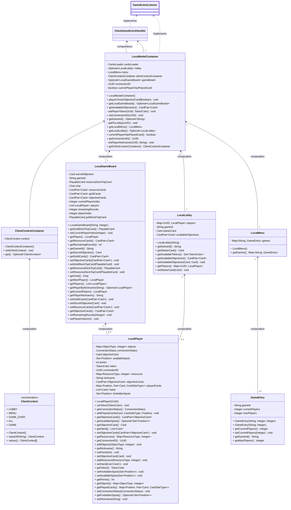

# UML Diagrams

# Index
-  [General architecture of the application](#general-architecture-of-the-application)
-  [Game Controller](#game-controller)
- [Game Model](#game-model)
    - [Game architecture](#game-architecture)
    - [Cards](#cards)
- [Client's local model](#clients-local-model)


## General architecture of the application

```mermaid
classDiagram
  direction TB 


class Main {
  + Main() 
  ~ printAsciiArt() void
  + main(String[]) void
  - startClient(String, ClientType, ConnectionType, Integer) void
  - printHelp() void
  - startServer(Integer, Integer) void
}

class AbstractServer {
  # AbstractServer(Integer, GameController) 
  # GameController controller
  # CountDownLatch serverReadyLatch
  + getServerReadyLatch() CountDownLatch
  + stop() void
  + start() void
}

class ClientGameEventHandler {
  + ClientGameEventHandler(View, LocalModelContainer) 
  - RemoteGameEventListener listener
  # LocalModelContainer localModel
  + handleInvalidActionException(InvalidActionException) void
  + getView() View
  + getRemoteListener() RemoteGameEventListener
}
class ClientType {
<<enumeration>>
  + ClientType() 
  +  GUI
  +  CLI
  + valueOf(String) ClientType
  + values() ClientType[]
}
class ConnectionType {
<<enumeration>>
  + ConnectionType() 
  +  TCP
  +  RMI
  + valueOf(String) ConnectionType
  + values() ConnectionType[]
  + getDefaultPort() int
}


class Cli {
  + Cli() 
  - LocalModelContainer localModel
  ~ Options options
  + printPrompt() void
  ~ diffMessage(int, Colorable) void
  ~ diffMessage(int, String) void
  + printUpdate(String) void
}
class CliClient {
  + CliClient() 
  ~ Cli cli
  ~ Scanner scanner
  - List~CommandHandler~ commandHandlers
  - initializeCommandHandlers() void
  - getClientContextContainer() ClientContextContainer
  + start(ConnectionType, String, int) void
  + main(String[]) void
}


class CommandHandler {
  + CommandHandler(String, String, ClientContext, Boolean) 
  + CommandHandler(String, String, ClientContext) 
  - String usage
  - ClientContext context
  - Boolean skipUsageCheck
  - String description
  + handle(String[]) void
  + getDescription() String
  + matchUsageString(String) boolean
  + getContext() Optional~ClientContext~
  + getUsage() String
}

class GuiClient {
  + GuiClient() 
  - Gui gui
  + main(String[]) void
  + start(ConnectionType, String, int) void
}

class Gui {
  + Gui() 
  - CountDownLatch isInitializedLatch
  - Scene scene
  - Stage primaryStage
  - NotificationLoader notificationLoader
  - ExceptionLoader exceptionLoader
  - String visibleUserNickname
  - ClientConnectionHandler client
  - LocalModelContainer localModel
  - CardSideType visibleHandSide
  - Integer selectedHandIndex
  - Gui gui
  - RulebookHandler rulebookHandler
  + getIsInitializedLatch() CountDownLatch
  - getCellClickHandler(Position) Runnable
  + drawResourcesAndObjects(LocalPlayer) void
  - updateGameBoardDrawAbility() void
  - loadGameEntry(GameEntry) Node
  - loadImage(GuiElement) ImageView
  + start(Stage) void
  - wrapAndBorder(ImageView) HBox
  + getInstance() Gui
  - drawGameWindow() void
  - loadSceneFXML(String, String) void
  - canPlayerPlaceCards() boolean
  - drawForbiddenPositions(Set~Position~, GridPane) void
  - toggleHandSide() void
  - drawAvailablePositions(Set~Position~, GridPane) void
  + drawChat() void
  - getCellPlacementActive() Supplier~Boolean~
  + main(String[]) void
  - loadCardImage(Card, CardSideType) ImageView
  - canPlayerDrawCards() boolean
  - loadImage(String) ImageView
}

class Cli-Options {
  + Options(Boolean) 
  - Boolean colored
  + isColored() Boolean
}
class Main-Options {
  + Options(Boolean) 
  - Boolean debugMode
  + isDebug() Boolean
}
class RMIClientConnectionHandler {
  + RMIClientConnectionHandler(String, Integer, View, ClientGameEventHandler) 
  - RMIServerConnectionHandler rmiConnectionHandler
  - getGameIDWithMessage() Optional~String~
  - handleInvalidActionException(InvalidActionException) void
}
class RMIServer {
  + RMIServer(Integer, GameController) 
  + start() void
  + stop() void
}
class RMIServerConnectionHandler {
  + sendChatMessage(UUID, ChatMessage) void
  + joinLobby(UUID, String) void
  + leaveLobby(UUID) void
  + deleteGame(UUID, String) void
  + lobbySetNickname(UUID, String) void
  + getLobbyObjectiveCards(UUID) Pair~Integer, Integer~
  + getLobbyStarterCard(UUID) Integer
  + createGame(UUID, String, Integer) void
  + heartBeat(UUID) void
  + getGamesCurrentPlayers() Map~String, Integer~
  + lobbySetTokenColor(UUID, TokenColor) void
  + startGame(UUID) void
  + joinGame(UUID, String, CardSideType) void
  + nextTurn(UUID, DrawingCardSource, DrawingDeckType) void
  + getGames() Set~String~
  + nextTurn(UUID) void
  + connect(UUID, RemoteGameEventListener) void
  + getAvailableTokens(String) Set~TokenColor~
  + getGamesMaxPlayers() Map~String, Integer~
  + placeCard(UUID, Integer, CardSideType, Position) void
  + lobbyChooseObjective(UUID, Boolean) void
}
class RMIServerConnectionHandlerImpl {
  + RMIServerConnectionHandlerImpl(GameController) 
  ~ GameController controller
}

class Server {
  + Server(Integer, Integer, GameController) 
  + Server(Integer, Integer) 
  ~ GameController controller
  ~ RMIServer rmiServer
  ~ TCPServer tcpServer
  ~ Integer rmiPort
  ~ Integer tcpPort
  + start() void
  + stop() void
}


Main "1" <-- "1" Server : composition 
Main "1" <-- "1" ViewClient : composition


Server "1" <-- "1" RMIServer  : composition
Server "1" <-- "1" TCPServer : composition

TCPServer "1" <-- "0..*" TCPServerConnectionHandler : contains

RMIServer "1" <-- "0..*" RMIServerConnectionHandler : contains

Server "1" <-- "1" GameController : composition
GameController "1" <-- "1" GameManager : composition


class TCPClientConnectionHandler {
  + TCPClientConnectionHandler(String, int, View, ClientGameEventHandler) 
  - Socket socket
  - ObjectInputStream inputStream
  - ObjectOutputStream outputStream
  - Queue~Message~ incomingMessages
  - Boolean waiting
  - ExecutorService threadManager

  - startMessageHandler() void
  + handleMessage(Message) void
  - getView() View
  - send(ClientMessage, Runnable, Runnable) void
  - send(ClientMessage) void
  - startMessageParser() void
  - getGameIDWithMessage() Optional~String~
}
class TCPServer {
  + TCPServer(Integer, GameController) 
  - ServerSocket serverSocket
  + start() void
  + stop() void
}

class TCPServerConnectionHandler {
  + TCPServerConnectionHandler(Socket, GameController) 
  - Queue~Message~ incomingMessages
  - ObjectOutputStream outputStream
  - ObjectInputStream inputStream
  - Socket socket
  - GameController controller
  - ExecutorService localExecutor
  - TCPServerControllerListener listener
  - startMessageHandler() void
  
  - handleMessage(Message) void
  + broadcast(Message) void
  - closeConnection() void
  + run() void
  - startMessageParser() void
  + send(Message) void
}
class TCPServerControllerListener {
  + TCPServerControllerListener(Consumer~Message~) 
  - Consumer~Message~ broadcast
}
class ViewClient {
  + ViewClient(View) 
  # View view
  # ClientType clientType
  # ClientConnectionHandler client
  # ConnectionType connectionType
  - CountDownLatch isInitializedLatch
  # getIsInitializedLatch() CountDownLatch
  + start(ConnectionType, String, int) void
}

class RemoteGameEventListener {
<<Interface>>
  + remainingRounds(String, int) void
  + lobbyInfo(LobbyUsersInfo) void
  + playerConnectionChanged(UUID, String, ConnectionStatus) void
  + winningPlayer(String) void
  + playerSetToken(String, UUID, String, TokenColor) void
  + playerScoresUpdate(Map~String, Integer~) void
  + getStarterCard(Integer) void
  + playerLeftLobby(String, UUID) void
  + playerSetNickname(String, UUID, String) void
  + refreshLobbies(Set~String~, Map~String, Integer~, Map~String, Integer~) void
  + changeTurn(String, String, Integer, Boolean, DrawingCardSource, DrawingDeckType, Integer, Integer, Set~Position~, Set~Position~, Integer, Integer) void
  + gameOver() void
  + playerJoinedGame(String, UUID, String, TokenColor, List~Integer~, Integer, CardSideType) void
  + gameDeleted(String) void
  + gameStarted(String, GameInfo) void
  + playerJoinedLobby(String, UUID) void
  + playerChoseObjectiveCard(String, UUID, String) void
  + cardPlaced(String, String, Integer, Integer, CardSideType, Position, int, Map~ResourceType, Integer~, Map~ObjectType, Integer~, Set~Position~, Set~Position~) void
  + gameCreated(String, int, int) void
  + chatMessage(String, ChatMessage) void
  + getObjectiveCards(Pair~Integer, Integer~) void
  + changeTurn(String, String, Integer, Boolean, Set~Position~, Set~Position~, Integer, Integer) void
}

class GameErrorListener {
<<Interface>>
  + gameNotFound(String) void
  + tokenTaken(TokenColor) void
  + gameNotStarted() void
  + nicknameTaken(String) void
  + gameNotReady() void
  + illegalCardSideChoice() void
  + invalidTokenColor() void
  + gameOver() void
  + gameAlreadyExists(String) void
  + playerNotActive() void
  + playerNotFound() void
  + notInLobby() void
  + alreadyPlacedCard() void
  + unknownResponse() void
  + invalidNextTurnCall() void
  + incompleteLobbyPlayer(String) void
  + emptyDeck() void
  + gameAlreadyStarted() void
  + lobbyFull(String) void
  + invalidCardPlacement(String) void
  + invalidGetObjectiveCardsCall() void
  + cardNotPlaced() void
  + notInGame() void
}

class View {
<<Interface>>
  + setClient(ClientConnectionHandler) void
  + drawPlayerObjective() void
  + drawPlayerBoard() void
  + drawCommonObjectiveCards() void
  + drawAvailableTokenColors() void
  + drawStarterCardSides() void
  + drawCardDecks() void
  + drawCard(Card) void
  + drawGame() void
  + postNotification(NotificationType, String[], Colorable, int) void
  + drawObjectiveCardChoice() void
  + drawPlayerBoards() void
  + drawLobby() void
  + listGames() void
  + drawGameOver() void
  + drawNicknameChoice() void
  + drawHand() void
  + displayException(Exception) void
  + drawLeaderBoard() void
  + getLocalModel() LocalModelContainer
  + drawPairs() void
  + drawAvailableGames() void
  + postNotification(Notification) void
  + drawGameBoard() void
  + postNotification(NotificationType, String) void
  + drawChatMessage(ChatMessage) void
  + drawPlayerBoard(String) void
}

class ClientConnectionHandler {
  + ClientConnectionHandler(String, Integer, View, ClientGameEventHandler) 
  # Integer port
  - Integer consecutiveFailedHeartBeats
  - View view
  - ConnectionStatus connectionStatus
  # String host
  # ConnectionType connectionType
  # UUID connectionID
  # ClientGameEventHandler gameEventHandler
  + lobbySetToken(TokenColor) void
  + getObjectiveCards() void
  + leaveLobby() void
  + lobbyChooseObjectiveCard(Boolean) void
  + lobbyJoinGame(CardSideType) void
  + heartBeat(Runnable, Runnable) void
  + getConnectionType() ConnectionType
  + isConnected() Boolean
  + getStarterCard() void
  + connect() void
  - disconnected() void
  + connectionFailed(Exception) void
  ~ getView() View
  + nextTurn() void
  + leaveGameLobby() void
  + connectionEstablished() void
  + lobbySetNickname(String) void
  + isLosing() Boolean
  + connectToGame(String) void
  + createGame(String, int) void
  + messageNotSent() void
  + disconnect() void
  + createAndConnectToGame(String, int) void
  # getConnectionID() UUID
  + sendChatMessage(ChatMessage) void
  + nextTurn(DrawingCardSource, DrawingDeckType) void
  - failedHeartBeat() void
  ~ getLocalModel() LocalModelContainer
  + isConnectedOrLosing() Boolean
  + getGames() void
  + getObjectivesIfNull() void
  + placeCard(Integer, CardSideType, Position) void
}

  View <.. Cli : implements
  View <.. Gui : implements

  GuiClient <-- Gui : composition
  CliClient <-- Cli : composition

  ViewClient <-- CliClient : extends
  ViewClient <-- GuiClient : extends

  ViewClient <-- ConnectionType : uses
  ViewClient <-- ClientType : uses
  ViewClient <-- ClientConnectionHandler : composition

  ViewClient <-- View : composition


  GameErrorListener <.. ClientGameEventHandler : implements
  GameEventListener <.. ClientGameEventHandler : implements
  
  CliClient "1" <-- "1..*"  CommandHandler : contains

  RemoteGameEventListener <-- GameEventListener 
  
  Cli <-- Cli-Options : composition
  Main <-- Main-Options : composition
  
  ClientConnectionHandler <-- RMIClientConnectionHandler : extends
  ClientConnectionHandler <-- TCPClientConnectionHandler : extends


  TCPServer <-- AbstractServer   : extends
  RMIServer <--  AbstractServer  : extends

  RMIServerConnectionHandler <.. RMIServerConnectionHandlerImpl : implements
  
  TCPServerConnectionHandler <-- TCPServerControllerListener: composition  
  GameEventListener <.. TCPServerControllerListener : implements

  GameEventListener <-- View : extends 


  style RemoteGameEventListener stroke:#00,stroke-width:4px
  style GameEventListener stroke:#00,stroke-width:4px
  style View stroke:#00,stroke-width:4px
  style ClientGameEventHandler stroke:#ffbb00,stroke-width:4px
```





## Game Controller
Since we chose a model heavy architecture, the game controller is merely a container of the game, that handles parsing requests from the `ServerConnectionHandlers` and updates their views trough their listeners.

```mermaid
classDiagram
  direction TB 

class GameController {
  + GameController() 
  ~ GameManager manager
  ~ Map~UUID, UserGameContext~ userContexts
  + lobbySetNickname(UUID, String) void
  - notifyClients(List~Pair~UUID, UserGameContext~~, RemoteListenerFunction, Boolean) void
  - getSameContextListeners(UUID, Boolean, EventDispatchMode) List~Pair~UUID, UserGameContext~~
  + removePlayerFromLobby(Game, UUID) void
  + getLobbyStarterCard(UUID) Integer
  + lobbyChooseObjective(UUID, Boolean) void
  + getCurrentSlots() Map~String, Integer~
  - sendGameStartedNotification(String, Game) void
  + joinGame(UUID, String, CardSideType) void
  + getGames() Set~String~
  - notifySameContextClients(UUID, RemoteListenerFunction) void
  + nextTurn(UUID) void
  + checkClientConnections() void
  + nextTurn(UUID, DrawingCardSource, DrawingDeckType) void
  + notifyDisconnectionsSameContext(List~UUID~, List~Pair~UUID, UserGameContext~~) void
  + lobbySetTokenColor(UUID, TokenColor) void
  + getGamesMaxPlayers() Map~String, Integer~
  + deleteGame(UUID, String) void
  + getGamesCurrentPlayers() Map~String, Integer~
  + joinLobby(UUID, String) void
  + isLastRound(String) Boolean
  - evaluateObjectives(Game, UUID) void
  + checkClientConnections(UUID) void
  + quitFromLobby(UUID) void
  + heartBeat(UUID) void
  + getLobbyObjectiveCards(UUID) Pair~Integer, Integer~
  + connect(UUID, RemoteGameEventListener) void
  + placeCard(UUID, Integer, CardSideType, Position) void
  - getUserContext(UUID) UserGameContext
  + notifyDisconnections(List~UUID~) void
  - nextTurnEvent(UUID, String, Game) void
  + getGame(String) Game
  - notifyClients(List~Pair~UUID, UserGameContext~~, RemoteListenerFunction) void
  + startGame(UUID) void
  - checkIfCurrentPlayer(Game, UUID) void
  + getAvailableTokens(String) Set~TokenColor~
  + getMaxSlots() Map~String, Integer~
  + sendChatMessage(UUID, ChatMessage) void
  - notifySameContextClients(UUID, RemoteListenerFunction, EventDispatchMode) void
  + createGame(UUID, String, Integer) void
}

class ClientGameEventHandler 

  GameEventListener  <..  GameController : implements
style GameEventListener stroke:#ff,stroke-width:4px


class GameManager {
  + GameManager() 
  - Map~String, Game~ games
  + getCurrentSlots() Map~String, Integer~
  + createGame(String, Integer) Game
  + getMaxSlots() Map~String, Integer~
  + getGames() Set~String~
  + getGame(String) Optional~Game~
  + deleteGame(String) void
} 


class EventDispatchMode {
<<enumeration>>
  + EventDispatchMode() 
  +  BOTH_WAYS
  +  BOTTOM_UP_FULL
  +  TOP_DOWN
  +  BOTH_WAYS_FULL
  +  BOTTOM_UP
  +  TOP_DOWN_FULL
  +  SAME_CONTEXT
  - isMenu(UserGameContextStatus) Boolean
  + valueOf(String) EventDispatchMode
  + checkDispatchable(UserGameContextStatus, UserGameContextStatus) Boolean
  - getContextRanking(UserGameContextStatus) Integer
  - isBothMenu(UserGameContextStatus, UserGameContextStatus) Boolean
  + values() EventDispatchMode[]
}


class UserGameContext {
  - UserGameContext(String, UserGameContextStatus, String, RemoteGameEventListener) 
  + UserGameContext() 
  + UserGameContext(String) 
  + UserGameContext(RemoteGameEventListener) 
  - Date lastHeartBeat
  - String gameId
  - RemoteGameEventListener listener
  - String nickname
  - UserGameContextStatus status
  + disconnected() Boolean
  + setNickname(String) void
  + removeGameId() void
  + setLobbyGameId(String) void
  + getGameId() Optional~String~
  + heartBeat() Boolean
  + checkConnection() Optional~ConnectionStatus~
  + getStatus() UserGameContextStatus
  + getConnectionStatus() ConnectionStatus
  + setGameId(String, String) void
  + setListener(RemoteGameEventListener) void
  + getNickname() Optional~String~
  + getListener() RemoteGameEventListener
}
class UserGameContextStatus {
<<enumeration>>
  + UserGameContextStatus() 
  +  MENU
  +  IN_GAME
  +  IN_LOBBY
  + valueOf(String) UserGameContextStatus
  + values() UserGameContextStatus[]
}


class ConnectionStatus {

<<enumeration>>
  + ConnectionStatus() 
  +  DISCONNECTED
  +  CONNECTED
  +  LOSING
  + values() ConnectionStatus[]
  + valueOf(String) ConnectionStatus
}
  GameController "1" <-- "1" GameManager
  GameController <-- UserGameContext  
  GameController <-- EventDispatchMode
  UserGameContext <-- UserGameContextStatus
  UserGameContext <-- ConnectionStatus  
 ```

 ## Game model
In designing our game model, we chose a model heavy approach to keep the game logic separated communications and to embrace object-oriented principles. The model is composed of a series of classes that represent the game entities and the game state. 

#### Documenting choices and design patterns in the model 
Some design choices we took that we think are worth documenting into detail are:
1. The hybrid approach to evaluating objectives and card placement points: to reflect actual game dynamics we decided to make the cards return a Function which will populated with the playerBoard attributes in the playerBoard context. This way we avoid sending around the playerBoard instances, which we considered a bad practice, and avoid duplicating it just to have the cards evaluate the points with their specificity, which we obtain nonetheless with this approach.      

2. The use of the Builder pattern for the Player class: since the player attributes are all final once chosen by the client, we decided to store PlayerBuilder instances in a hashmap in the Lobby class as the controller layer handles the parsing of the client inputs. This way a player is added to the Game's Player list only when finalized (once they have chosen their Secret Objective).

3. Some classes can be considered redundant as they could be easily implemented as part of the class they are a composition to. We decided to keep them separate to keep the code more readable and to make the implementation of the GUI easier as these entities are effectively functional on their own and can be considered "Drawable". 


### Game architecture

```mermaid

---
title: Rest of the model
---
classDiagram

class TokenColor{
    <<Enumeration>>
    RED
    BLUE
    GREEN
    YELLOW
    BLACK

    +getColor() Color
    +fromString(String color) TokenColor
    +getImagePath() String
}


class Lobby{
    %% the lobby players are stored in a hashmap with the socket id as key and the player builder as value, while the players are being constructed the player builder is updated with the player's attributes
    lobbyPlayers: HashMap~SocketId; PlayerBuilder~

    %% We store the extracted objective cards in a HashMap along with the socket id, ensuring they can be restored to the deck if the player disconnects.
    extractedCards: HashMap~SocketId;CardPair~ObjectiveCard~~
    remainingPlayers: int 
    %% counts how many players you can still add to the game

    %% arraylist of available tokens

    Lobby(int maxplayers)
    Lobby()

    getRemainingPlayerSlots() int
    getPlayersCount() int

    addPlayer(UUID socketId, CardPair~ObjectiveCard~ objectiveCards, PlayableCard starterCard) void

    removePlayer(UUID socketId) Pair~CardPair~ObjectiveCard~, PlayableCard~ ~~throws~~ PlayerNotFoundExcpetion

    setNickname(UUID socketId, String nickname) void ~~throws~~ PlayerNotFoundExcpetion, NicknameAlreadyTakenException

    setToken(UUID socketId, TokenColor tokenColor) void ~~throws~~ PlayerNotFOundExcpetion, TokenAlreadyTakenExcpetion

    setObjectiveCard(UUID socketId, Boolean firstObjectiveCard) void ~~PlayerNotFoundException~~

    finalizePlayer(UUID socketId, CardSideType cardSide, List~PlayableCard~ hand) Player ~~throws~~ PlayerNotFoundException, IncompletePlayerBuilderException, IllegalCardSideChoiceException, IllegalPlacingPositionException

    getPlayerObjectuveCards(UUID socketId) Optional~CardPair~ObjectiveCard~~

    containsSocketID(UUID socketId) boolean
    getPlayerNickname(UUID socketId) Optional~String~ ~~throws~~ PlayerNotFoundException
    getPlayerTokenColor(UUID socketId) Optional~TokenColor~ ~~throws~~ PlayerNotFoundException

    getAvailableColors() Set~TokenColor~
    getPlayerInfo() Map~UUID socketId, Pair~String, TokenColor~~

    getStarterCard(UUID socketId) PlayableCard ~~throws~~ PlayerNotFoundException
}

PlayerNotFoundExcpetion <-- Lobby: throws
NicknameAlreadyTakenException <-- Lobby: throws
TokenAlreadyTakenException <-- Lobby: throws
IncompletePlayerBuilderException <-- Lobby: throws
IllegalCardSideChoiceException <-- Lobby: throws
IllegalPlacingPositionExcpetion <-- Lobby: throws



class LobbyFullExcpetion {
    +LobbyFullException
}

class IllegalCardSideChoiceException {
    +IllegalCardSideChoiceException()
}

class IllegalPlacingPositionException {
    +IllegalPlacingPositionException()
    +IllegalPlacingPositionExcpetion(String message)
}


class NicknameAlreadyTakenException {
    +NicknameALreadyTakenException(String nickname)

    +getNickname() String
}

class Game {
    -WINNING_POINTS: ~final~ int
    -players: List~Player~
    -gameBoard: GameBoard
    -lobby: Lobby
    -state: GameState
    -RemainingRounds: Integer
    -currentPlayer: Integer
    -maxPlayer: Integer
    -chat: Chat

    Game(int players)
    Game(int players, JSONArray cards)

    getLobby() Lobby
    start() void

    drawObjectiveCardPair() CardPair~ObjectiveCard~
    getState() GameState
    getPlayerState(String nickname) PlayerState
    getScoreBoard() Map~String, Integer~
    getCurrentPlayer() Player
    getPlayers() List~Player~
    getPlayerIds() List~String~
    getCurrentPlayerIndex() Integer
    addPlayer(Player player) void
    isGameOver() boole
    setGameOver() void
    getRemainingRounds() Optional~Integer~
    isResourceDeckEmpty() boole
    isGoldDeckEmpty() boole
    areDecksEmpty() boole

    nextTurn(DrawingCardSource drawingSource, DrawingDeckType, deckType, BiConsumer~Integer, Integer~ drawCardsCallback) void ~~throws~~ GameOverException, EmptyDeckExcpetion, InvalidNextTurnCallExcpetion
    nextTurn(DrawingCardSource drawingSource, DrawingDeckType deckType) void ~~throws~~ GameOverExcpetion, EmptyDeckExcpetion, InvalidNextTurnCallExcpetion
    nextTurn() void ~~throws~~ GameOverExcpetion, InvalidNextTurnCallExcpetion

    getPlayerOrder() List~String~
    drawStarterCard() PlayableCard ~~throws~~ EmptyDeckExcpetion
    insertObjectiveCard(ObjectiveCard objectiveCard)
    insertStarterCard(PlayableCard starterCard)
    isLastRound() boole
    drawHand() List~PlayableCard~ ~~throws~~ EmptyDeckExcpetion

    getPlayersCount() Integer
    getMaxPlayer() Integer
    getPlayersSpotsLeft() Integer
    getChat() Chat
    getGameBoard() GameBoard
}

GameOverExcpetion <-- Game: throws
EmptyDeckExcpetion <-- Game: throws
InvalidNextTurnCallExcpetion <-- Game: throws


class GameManger {
    -games: Map~String, Game~

    GameManger()

    getGames() Set~String~
    getCurrentSlots() Map~String, Integer~
    getMaxSlots() Map~String, Integer~
    getGame(String gameName) Optional~Game~
    createGame(String gameName, Integer players) Game
    deleteGame(String gameName) void 
}


class GameOverException {
    +GameOverException()
}

Game --|> Lobby : composition
Game --|> GameOverException : composition
Game --|> EmptyDeckException : composition

class GameState {
    <<Enumeration>>
    GAME_INIT
    PLAYING
    GAME_OVER
}

class PlayerState{
    <<Enumeration>>
    WAITING
    PLAYING
}


class Deck~T~ {
    -cards: List~T~
    %% Una pila forse
    Deck(List~T~ cards)
    shuffle() void
    draw() T ~~throws~~ EmptyDeckException
    draw(int N) List~T~ ~~throws~~ EmptyDeckException
    getCardsLeft() int
    %% insert card back after card drawing. (ie when you don't choose an objective)
    insert(T card) void
}

class Player {
    -nickname: String
    -points: int
    -token: TokenColor
    -board: PlayerBoard
    -socketId: UUID
    -cardPlacedThisTurn: boole

    %% the player constructor takes the bulder, that is used to get necessary information to build the player
    %% and the board that is initialized inside the build() function drawing and setting the necessary cards in hand
    Player(PlayerBuilder builder, UUID socketId)

    getSocketId() UUID
    +getNickname() String
    +getBoard() PlayerBoard
    +getToken() TokenColor
    +getPoints() int
    +hasPlacedCardThisTurn() boole
    +toggleCardPlacedThisTurn() void
    +drawCard(PlayableCard card) void
    +placeCard(int cardIndex, CardSideType side, Position position) PlayableCard
    +evaluate(ObjectiveCard objectiveCard) void
    +evaluateSecretObjective() void
}

Player *-- PlayerBuilder : composition

class PlayerBuilder {
    -nickname: String
    -token: TokenColor
    -objectiveCard: ObjectiveCard
    -starterCard: PlayableCard
    -cards: List~PlayableCard~

    PlayerBuilder(PlayableCard card)

    setNickname(String nickname) PlayerBuilder
    getNickname() Optional~String~
    setTokenColor(TokenColor token) PlayerBuilder
    getTokenColor() Optional~TokenColor~
    getHand() Optional~List~PlayableCard~~
    setHand(List~PlayableCard~ cards) PlayerBuilder
    setStarterCard(PlayableCard starteCard) PlayerBuilder
    setStarterCardSide(CardSideType side) void
    setObjectiveCard(ObjectiveCard objectiveCard) PlayerBuilder
    build(UUID socketId) Player
    getStarterCard() PlayableCard
}

IllegalCardSideChoiceExcpetion <-- PlayerBoard: throws
IllegalPlacingPositionExcpetion <-- PlayerBoard: throws

class PlayerBoard {
    -hand: List~PlayableCard~
    -objectiveCard: ObjectiveCard

    -playedCards: HashMap~Position, PlayableCard~
    %% the geometry is an hashmap of positions and played cards

    -availableSpots: Set~Position~
    -forbiddenSpots: Set~Position~
    %% the available spots for the player to place a card on the board

    -resources: HashMap~ResourceType, Integer~
    -objects: HashMap~Objects, Integer~

    mapUpdater: MapUpdater

    availableSpots: Set~Position~
    forbiddenSpots: Set~Position~
    
    PlayerBoard(List~PlayableCard~ hand, PlayableCard starterCard, ObjectiveCard objectiveCard) ~~throws~~ IllegalCardSideChoiceException, IllegalPlacingPositionException

    getObjectiveCard() ObjectiveCard
    getHand() List~PlayableCard~
    getPlaceableCardSides() List~PlayableSide~

    drawCard(PlayableCard card)
    placeCard(PlayableCard playedCard, CardSdieType playedSideType, Position position)

    updateResourcesAndObjects(PlayableCard playedCard, Position position)
    updateResourcesAndObjectsMaps(Corner~T~ corner, int delta)
    updateAvailableSpots(PlayableSide playableSide, Position position)
    getObjects() Map~ObjectType, Integer~
    getResources() Map~ResourceType, Integer~
    getPlayedCards() Map~Position, PlayableCard~
    getAvailableSpots() Set~Position~
    getForbiddenSpots() Set~Position~
}

class MapUpdater {
    MapUpdater()
    visit(ObjectType object, int delta) void
    visit(ResourceType resource, int delta) void
}
CornerContentVisitor <.. MapUpdater : realization
PlayerBoard *-- MapUpdater : contains

class DeckType {
    <<Enumeration>>
    GOLD_DECK
    RESOURCE_DECK
}

class DrawingDeckType {
    <<Enumeration>>
    RESOURCE
    GOLD

    toString() String
}

class DrawingSourceType {
    <<Enumeration>>
    DECK
    COMMON_BOARD
}

class Position{
    -x: int
    -y: int

    Position(int x, int y)
    Position()

    %% Overriding default hashmap key methods
    equals(Object o) boolean
    computeAdjacentPosition(AdjacentPosition adjacentPosition) Position
    hashCode() int
}

class GameBoard {
    -goldDeck : Deck~PlayableCard~
    -goldCards: CardPair~PlayableCard~
    -starterDeck: Deck~PlayableCard~
    -objectiveDeck: Deck~ObjectiveCard~
    -resourceDeck: Deck~PlayableCard~
    -resourceCards: CardPair~PlayableCard~
    -objectiveCards: CardPair~ObjectiveCard~

    GameBoard fromJSON(JSONArray cards)
    GameBoard(CardsLoader loader)
    %% the game board has two constructors, one with parameters and one without
    %% the constructor with parameters is used to restore a game from a save file
    GameBoard(CardPair~Goldcards~ goldCards, CardPair~PlayableCard~ resourceCards, \nCardPair~ObjectiveCard~ objectiveCards, \nDeck~PlayableCard~ starterDeck, \nDeck~ObjectiveCard~ objectiveDeck, \nDeck~PlayableCard~ resourceDeck, \nDeck~GoldCard~ goldDeck)
    %% the constructor without parameters is used to create a new game
    GameBoard(List~PlayableCard~ goldCardsList,\n \nList~PlayableCard~ starterCardsList, \nList~ObjectiveCard~ objectiveCardsList, \nList~PlayableCard~ resourceCardsList)

    drawGoldCardFromDeck() PlayableCard ~~throws~~ EmptyDeckException
    +drawCard() PlayableCard
    +drawCard(DrawingCardSource drawingSource, DrawingDeckType deckType) PlayableCard ~~throws~~ EmptyDeckException
    +getGoldCard() CardPair~PlayableCard~
    +getResourceCards() CardPair~PlayableCard~
    +goldCardsLeft() int
    +drawStarterCardFromDeck() PlayableCard ~~EmptyDeckExcpetion~~
    +starteCardsLeft() int
    drawObjectiveCardFromDeck() ObjectiveCard ~~EmptyDeckExcpetion~~
    getObjectiveCards() CardPair~ObjectiveCard~
    insertObjectiveCard(ObjectiveCard card) void
    insertStarterCard(PlayableCard card) void
    objectiveCardsLeft() int
    drawResourceCardFromDeck() PlayableCard ~~throws~~ EmptyDeckExcpetion
    drawResourceCardFromDeck(int n) List~PlayableCard~
    drawResourceCardFromPair(Boolean first) PlayableCard~EmptyDeckExcpetion~
    resourceCardsLeft() int
    drawObjectiveCardPair() cardPair~ObjectiveCard~ ~~throws~~ EmptyDeckException
}

EmptyDeckExcpetion <-- GameBoard: throws

class PlayerNotFoundExcpetion {
    +PlayerNotFoundException(UUID playerId)
    +PlayerNotFoundExcpetion(String username)
}

class TokenAlreadyTakenException {
    +TokenALreadyTakenExcpetion(TokenColor color)

    getTokenColor() TokenColor
}

class IncompletePlayerBuilderException {
    +IncompletePlayerBuilderException(String message)

    +checkPlayerBuilder(Player.PlayerBuilder playerBuilder)
}



class EmptyDeckException {
    +EmptyDeckException()
}

Game "2"*--"4" Player : composition
Game "1"*--"1" GameBoard : composition
Game "1"*--"9" TokenColor : composition
GameBoard "1"*--"4" Deck : composition

PlayerBoard <-- Position : uses
Player --* PlayerBoard: composition

Player <-- DrawingSourceType : uses
Player <-- DeckType : uses
%% Player --> PlayerActions : offers

GameBoard --|> EmptyDeckException : composition
Deck --|> EmptyDeckException : composition

GameBoard <-- CardPair: uses
```




### Cards


## Client's local model
Since the game model is quite complex, we decided to split the model implementations between the server and the client. The client's model is a simplified version of the server's model, which is merely used to save the current status of the game to update the view whenever is necessary.
The local model Updates are triggered by the `ClientConnectionHandler` methods, which implement the `(Remote)GameEventListener` interface, the `ClientGameEventHandler` class is responsible for handling the events and updating the local model and the view accordingly through the same interface methods.



## View 
For the sake of completeness we also include the autogenerated uml diagram of the View classes. 

```mermaid
classDiagram
direction BT
class Cli {
  + Cli() 
  - LocalModelContainer localModel
  ~ Options options
  + printPrompt() void
  + displayException(Exception) void
  + drawHand() void
  + postNotification(Notification) void
  + drawGame() void
  + postNotification(NotificationType, String) void
  + drawLobby() void
  ~ diffMessage(int, Colorable) void
  + listGames() void
  ~ diffMessage(int, String) void
  + lobbyInfo(LobbyUsersInfo) void
  + drawCardDecks() void
  + drawStarterCardSides() void
  + drawObjectiveCardChoice() void
  + getStarterCard(Integer) void
  + drawLeaderBoard() void
  + drawChatMessage(ChatMessage) void
  + drawGameOver() void
  + postNotification(NotificationType, String[], Colorable, int) void
  + drawCard(Card) void
  + drawGameBoard() void
  + drawCommonObjectiveCards() void
  + playerScoresUpdate(Map~String, Integer~) void
  + playerJoinedLobby(String, UUID) void
  + getLocalModel() LocalModelContainer
  + drawNicknameChoice() void
  + drawAvailableGames() void
  + drawPairs() void
  + drawPlayerObjective() void
  + cardPlaced(String, String, Integer, Integer, CardSideType, Position, int, Map~ResourceType, Integer~, Map~ObjectType, Integer~, Set~Position~, Set~Position~) void
  + getObjectiveCards(Pair~Integer, Integer~) void
  + drawPlayerBoards() void
  + setClient(ClientConnectionHandler) void
  + drawAvailableTokenColors() void
  + printUpdate(String) void
  + drawPlayerBoard(String) void
}
class CliCard {
<<Interface>>
  + cardToString() String
  + cardToAscii(HashMap~Integer, String~) String
  + cardToAscii() String
  + playableCardToAscii(HashMap~Integer, String~) String
}
class CliClient {
  + CliClient() 
  ~ Cli cli
  ~ Scanner scanner
  - List~CommandHandler~ commandHandlers
  - initializeCommandHandlers() void
  - getClientContextContainer() ClientContextContainer
  + start(ConnectionType, String, int) void
  + main(String[]) void
}
class CliUtils {
  + CliUtils() 
  + getColorableLength(Colorable, int, ColorStyle) int
  + colorizeAndCenter(List~T~, int, char, ColorStyle) String
  + colorize(String, Color, ColorStyle) String
  + colorize(T, ColorStyle) String
  + getTable(String[], ArrayList~String~[]) String
  + joinMinLines(String, String) String
  + colorize(T, ColorStyle, int) String
}
class Color {
<<enumeration>>
  - Color(String, String, String, String, String) 
  +  RED
  +  GRAY
  +  BLUE
  +  GREEN
  +  WHITE
  + String bright
  + String background
  +  YELLOW
  +  BLACK
  + String bold
  +  PURPLE
  +  CYAN
  + String underlined
  +  RESET
  + String normal
  + values() Color[]
  + getCode(ColorStyle) String
  + valueOf(String) Color
  + colorize(String, Color, ColorStyle) String
}
class ColorStyle {
<<enumeration>>
  + ColorStyle() 
  +  BACKGROUND
  +  BRIGHT
  +  BOLD
  +  NORMAL
  +  UNDERLINED
  + valueOf(String) ColorStyle
  + values() ColorStyle[]
}
class Colorable {
<<Interface>>
  + getColor() Color
}
class CommandHandler {
  + CommandHandler(String, String, ClientContext, Boolean) 
  + CommandHandler(String, String, ClientContext) 
  - String usage
  - ClientContext context
  - Boolean skipUsageCheck
  - String description
  + handle(String[]) void
  + getDescription() String
  + matchUsageString(String) boolean
  + getContext() Optional~ClientContext~
  + getUsage() String
}
class DraggableLayout {
  + DraggableLayout() 
  - double yOffset
  - double xOffset
  + setDraggable(Stage) void
  + setDraggable(Stage, Node) void
}
class ExceptionLayout {
  + ExceptionLayout() 
  - Text exceptionTitle
  ~ Node exceptionContainer
  - VBox exceptionMessageVBox
  - Button exceptionCloseButton
  ~ Parent exceptionLayout
  + setDraggable(Stage) void
  - loadException() void
  + loadExceptionDetails(Exception) void
  + getParent() Parent
}
class ExceptionLoader {
  + ExceptionLoader(Stage) 
  - Stage exceptionStage
  + loadException(Exception) void
  - showException(ExceptionLayout) void
}
class GridCell {
  + GridCell(Runnable, Supplier~Boolean~) 
  + int CELL_WIDTH
  - GridCellStatus status
  + int TARGET_WIDTH
  + int TARGET_HEIGHT
  + int CELL_HEIGHT
  + setStatus(GridCellStatus) void
  + placeCard(ImageView) void
}
class GridCellStatus {
<<enumeration>>
  + GridCellStatus() 
  +  INACTIVE
  +  FORBIDDEN
  +  AVAILABLE
  + valueOf(String) GridCellStatus
  + values() GridCellStatus[]
}
class Gui {
  + Gui() 
  - CountDownLatch isInitializedLatch
  - Scene scene
  - Stage primaryStage
  - NotificationLoader notificationLoader
  - ExceptionLoader exceptionLoader
  - String visibleUserNickname
  - ClientConnectionHandler client
  - LocalModelContainer localModel
  - CardSideType visibleHandSide
  - Integer selectedHandIndex
  - Gui gui
  - RulebookHandler rulebookHandler
  + drawGameOver() void
  + getLocalModel() LocalModelContainer
  + playerSetToken(String, UUID, String, TokenColor) void
  + drawCardDecks() void
  + getIsInitializedLatch() CountDownLatch
  - getCellClickHandler(Position) Runnable
  + gameDeleted(String) void
  + drawResourcesAndObjects(LocalPlayer) void
  + winningPlayer(String) void
  + displayException(Exception) void
  - updateGameBoardDrawAbility() void
  + playerSetNickname(String, UUID, String) void
  + drawHand() void
  + remainingRounds(String, int) void
  - loadGameEntry(GameEntry) Node
  + drawCommonObjectiveCards() void
  - loadImage(GuiElement) ImageView
  + drawStarterCardSides() void
  + start(Stage) void
  + drawPlayerBoards() void
  + getObjectiveCards(Pair~Integer, Integer~) void
  + gameCreated(String, int, int) void
  + playerLeftLobby(String, UUID) void
  - wrapAndBorder(ImageView) HBox
  + postNotification(NotificationType, String) void
  + lobbyInfo(LobbyUsersInfo) void
  + drawGameBoard() void
  + getStarterCard(Integer) void
  + getInstance() Gui
  + drawGame() void
  - drawGameWindow() void
  - loadSceneFXML(String, String) void
  + drawAvailableGames() void
  + chatMessage(String, ChatMessage) void
  - canPlayerPlaceCards() boolean
  - drawForbiddenPositions(Set~Position~, GridPane) void
  - toggleHandSide() void
  + gameStarted(String, GameInfo) void
  - drawAvailablePositions(Set~Position~, GridPane) void
  + drawChatMessage(ChatMessage) void
  + drawLeaderBoard() void
  + gameOver() void
  + drawObjectiveCardChoice() void
  + drawChat() void
  + playerConnectionChanged(UUID, String, ConnectionStatus) void
  + drawPlayerObjective() void
  + drawAvailableTokenColors() void
  - getCellPlacementActive() Supplier~Boolean~
  + playerScoresUpdate(Map~String, Integer~) void
  + main(String[]) void
  + postNotification(Notification) void
  + playerJoinedLobby(String, UUID) void
  + setClient(ClientConnectionHandler) void
  + drawLobby() void
  + listGames() void
  + playerChoseObjectiveCard(String, UUID, String) void
  + drawCard(Card) void
  + drawPairs() void
  - loadCardImage(Card, CardSideType) ImageView
  - canPlayerDrawCards() boolean
  - loadImage(String) ImageView
  + postNotification(NotificationType, String[], Colorable, int) void
  + drawPlayerBoard(String) void
  + drawNicknameChoice() void
}
class GuiClient {
  + GuiClient() 
  - Gui gui
  + main(String[]) void
  + start(ConnectionType, String, int) void
}
class GuiElement {
<<Interface>>
  + getImagePath() String
  + getBasePath() String
}
class GuiUtils {
  + GuiUtils() 
  + getColorClass(ResourceType) String
}
class Notification {
<<enumeration>>
  - Notification(NotificationType, String) 
  +  MESSAGE_NOT_SENT
  - String message
  - NotificationType notificationType
  +  UNKNOWN_MESSAGE
  +  CONNECTION_ESTABLISHED
  +  ALREADY_WAITING
  +  CONNECTION_FAILED
  +  UNKNOWN_RESPONSE
  + getNotificationType() NotificationType
  + valueOf(String) Notification
  + getMessage() String
  + values() Notification[]
}
class NotificationLayout {
  + NotificationLayout() 
  ~ Parent notificationLayout
  ~ Node notificationContainer
  ~ ProgressBar progressBar
  ~ Text notificationText
  + startProgressBar(int, boolean) void
  + setDraggable(Stage) void
  - loadNotification() void
  + getParent() Node
  - setNotificationType(NotificationType) void
  - setNotificationText(String) void
}
class NotificationLoader {
  + NotificationLoader(Stage) 
  - Stage notificationStage
  - Queue~NotificationLayout~ notifications
  + processNotifications() void
  + addNotification(NotificationType, String) void
}
class NotificationType {
<<enumeration>>
  + NotificationType() 
  +  UPDATE
  +  CONFIRM
  +  WARNING
  +  ERROR
  +  RESPONSE
  + getColor() Color
  + valueOf(String) NotificationType
  + values() NotificationType[]
  + getStyleClass() String
}
class Options {
  + Options(Boolean) 
  - Boolean colored
  + isColored() Boolean
}
class RulebookHandler {
  + RulebookHandler(Stage) 
  - Stage rulebookStage
  - RulebookLayout rulebookLayout
  - showRulebook() void
  + loadRulebook() void
}
class RulebookLayout {
  + RulebookLayout() 
  ~ Node rulebookContainer
  - List~Image~ pages
  - int currentPage
  - HBox pageContainer
  - ImageView page
  ~ Parent rulebookLayout
  + closeRulebook() void
  + getParent() Parent
  - handleNextPage() void
  + loadRulebookDetails() void
  - updatePageView() void
  + setDraggable(Stage) void
  + loadRulebook() void
  - handlePreviousPage() void
}
class View {
<<Interface>>
  + setClient(ClientConnectionHandler) void
  + gameDeleted(String) void
  + refreshLobbies(Set~String~, Map~String, Integer~, Map~String, Integer~) void
  + changeTurn(String, String, Integer, Boolean, DrawingCardSource, DrawingDeckType, Integer, Integer, Set~Position~, Set~Position~, Integer, Integer) void
  + drawPlayerObjective() void
  + getStarterCard(Integer) void
  + drawPlayerBoard() void
  + drawCommonObjectiveCards() void
  + playerSetToken(String, UUID, String, TokenColor) void
  + drawAvailableTokenColors() void
  + winningPlayer(String) void
  + lobbyInfo(LobbyUsersInfo) void
  + drawStarterCardSides() void
  + drawCardDecks() void
  + playerSetNickname(String, UUID, String) void
  + drawCard(Card) void
  + drawGame() void
  + postNotification(NotificationType, String[], Colorable, int) void
  + playerConnectionChanged(UUID, String, ConnectionStatus) void
  + playerJoinedGame(String, UUID, String, TokenColor, List~Integer~, Integer, CardSideType) void
  + chatMessage(String, ChatMessage) void
  + drawObjectiveCardChoice() void
  + drawPlayerBoards() void
  + playerLeftLobby(String, UUID) void
  + drawLobby() void
  + listGames() void
  + drawGameOver() void
  + gameCreated(String, int, int) void
  + drawNicknameChoice() void
  + drawHand() void
  + displayException(Exception) void
  + gameStarted(String, GameInfo) void
  + getObjectiveCards(Pair~Integer, Integer~) void
  + drawLeaderBoard() void
  + getLocalModel() LocalModelContainer
  + drawPairs() void
  + cardPlaced(String, String, Integer, Integer, CardSideType, Position, int, Map~ResourceType, Integer~, Map~ObjectType, Integer~, Set~Position~, Set~Position~) void
  + changeTurn(String, String, Integer, Boolean, Set~Position~, Set~Position~, Integer, Integer) void
  + playerScoresUpdate(Map~String, Integer~) void
  + drawAvailableGames() void
  + postNotification(Notification) void
  + playerChoseObjectiveCard(String, UUID, String) void
  + remainingRounds(String, int) void
  + drawGameBoard() void
  + postNotification(NotificationType, String) void
  + gameOver() void
  + playerJoinedLobby(String, UUID) void
  + drawChatMessage(ChatMessage) void
  + drawPlayerBoard(String) void
}
class ViewClient {
  + ViewClient(View) 
  # View view
  # ClientConnectionHandler client
  - CountDownLatch isInitializedLatch
  # ClientGameEventHandler gameEventHandler
  # getIsInitializedLatch() CountDownLatch
  + start(ConnectionType, String, int) void
}
class ViewGridPosition {
  + ViewGridPosition(int, int) 
  + ViewGridPosition(Position) 
  - int row
  + int gridSize
  - int col
  + getRow() int
  + getCol() int
  + getModelPosition() Position
}

Cli  ..>  View 
CliClient  -->  ViewClient 
CliClient  -->  CommandHandler 
ExceptionLayout  -->  DraggableLayout 
ExceptionLoader  -->  ExceptionLayout 
Gui  ..>  View 
GuiClient  -->  ViewClient 
NotificationLayout  -->  DraggableLayout 
NotificationLoader  -->  NotificationLayout 
NotificationType  ..>  Colorable 
Cli  -->  Options 
RulebookLayout  -->  DraggableLayout 
RulebookHandler  -->  RulebookLayout 
```



