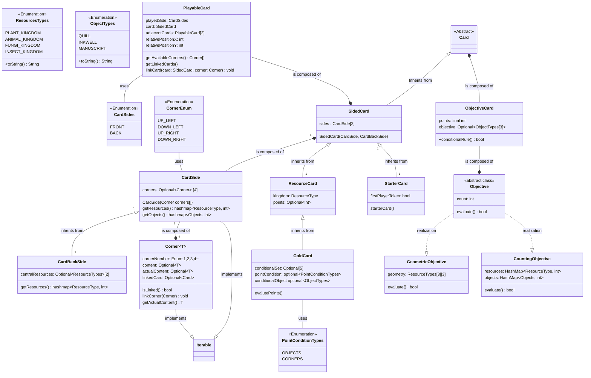

# UML progetto di ingegneria del software
 A rough view of the UML of Model View Controller:
- **Model**: will be connected to the server side controller
    - *Game*: enforces the games rhythm, general rules about the game status, calls for turns and rounds, creates the game boards (common and personal), instantiates the players (passing their boards as parameters) and the decks of cards, keeps track of the game state and the game over condition.
    - *Player*: can play a turn (try to play a card on the player board given as parameter to their constructor and receive drawn cards), has points, 
        - *Player Board*: enforces rules for card placement and keeps tracks of resources, objets the geometry of the cards placed onto it
    - *Cards hierarchy*: The uml is pretty self explanatory
    - *GameBoard*: composed of (composition class to keep things tidy (is it necessary tho?)
        - *Score Board*: hashmap with buckets, of (lists of) player tokens (optional utility to useful for the GUI development eventually)
        - *Common Board*: common cards for everyone to use, methods to get and draw cards from here (the latter also draws a new card from the deck) (card retrieval methods comprehend common goals retrival for point calculation). 
        - *Card's Decks* : methods to shuffle and retrieve cards from the decks.
        -
- **View**:
    - Cli: text based implementation of the game components for the client
    - Gui: javaFX implementation of the game components for the client
- **Controller**:
    - Client: will handle input received from the respective views and will submit it to the server.
    - Server: will instantiate the game and handle the communications with all the clients.

## Model

### Cards

### Game model

## Considerazioni
La ratio è implementare ogni elemento che può diventare grafico come una classe a se stante, in modo tale che ci sia corrispondenza una volta che si implementa la view. Ogni elemento avrà un decorator toString per la realizzare la cli e un metodo per disegnarlo sulla GUI

